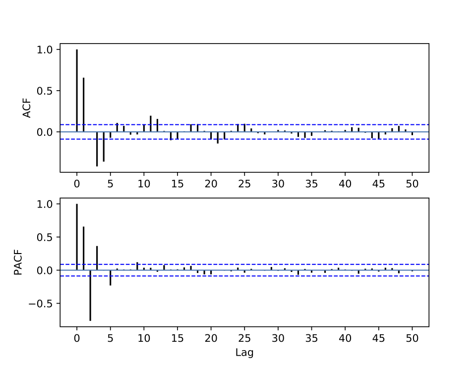
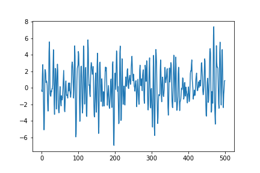

[](http://quantlet.de/)

## [](http://quantlet.de/) **pyTSA_ARMA** [](http://quantlet.de/)

```yaml


Name of Quantlet:    'pyTSA_ARMA'

Published in:        'Applied Time Series Analysis and Forecasting with Python'

Description:         'This Quantlet simulates and plots ARMA(2,2) - autoregressive moving average process time series, its ACF and PACF'

Keywords:            'time series,  stationarity, autocorrelation, PACF, ACF, simulation, stochastic process, ARMA, moving average, autoregression'

Author[New]:         Huang Changquan, Alla Petukhina


```






### PYTHON Code
```python

import numpy as np
import pandas as pd
import matplotlib.pyplot as plt
from statsmodels.tsa.arima_process import arma_generate_sample
from PythonTsa.plot_acf_pacf import acf_pacf_fig
ar = np.array([1, -0.8, 0.6])
ma = np.array([1, 0.7, 0.4])
np.random.seed(123457)
x =  arma_generate_sample(ar = ar, ma = ma, nsample = 500)
x = pd.Series(x)
x.plot(); plt.savefig('TSP_ARMA_fig3-19.png'), plt.show()
acf_pacf_fig(x, both = True, lag=50)
```

automatically created on 2022-01-20