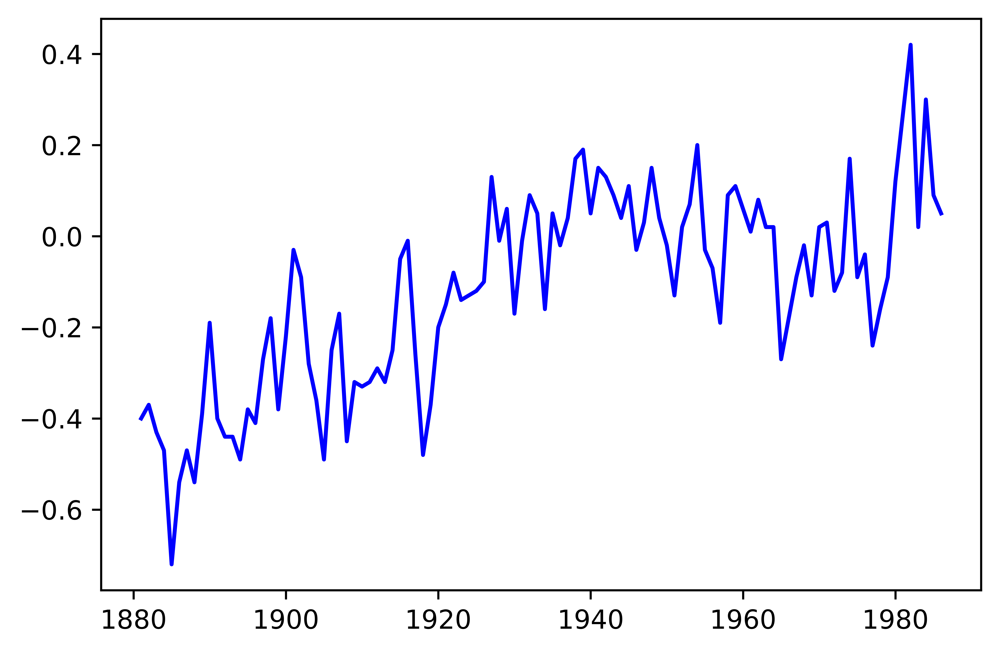
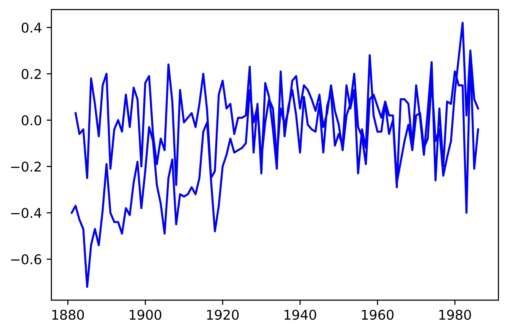
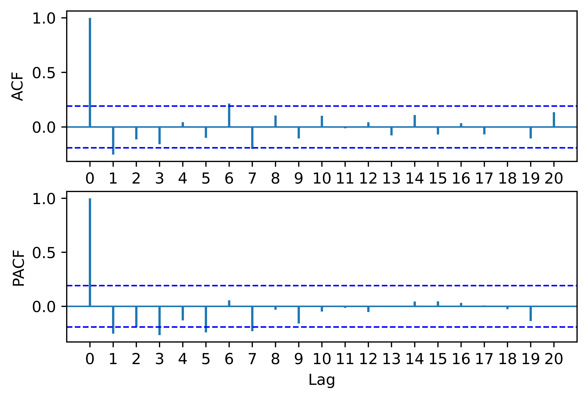
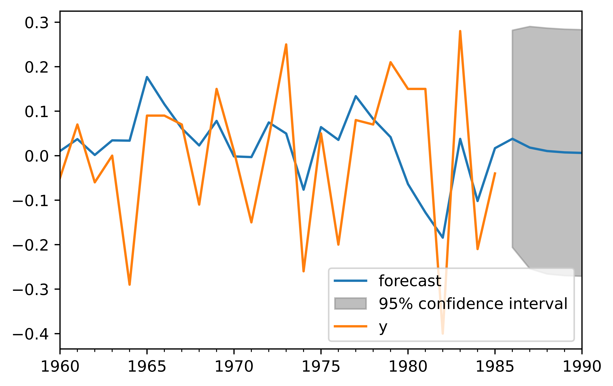

[](http://quantlet.de/)

## [](http://quantlet.de/) **pyTSA_AirTempChange** [](http://quantlet.de/)

```yaml


Name of Quantlet:    'pyTSA_AirTempChange'

Published in:        'Applied Time Series Analysis and Forecasting with Python'

Description:         'This Quantlet simulates ARMA(2,2) - autoregressive moving average process and draws the true ACF and PACF'

Keywords:            'time series,  stationarity, autocorrelation, PACF, ACF, simulation, stochastic process, ARMA, moving average, autoregression'

Author[New]:         Huang Changquan, Alla Petukhina


```










### PYTHON Code
```python

import pandas as pd
#import numpy as np
import matplotlib.pyplot as plt
import statsmodels.api as sm
from PythonTsa.plot_acf_pacf import acf_pacf_fig
from PythonTsa.Selecting_arma import choose_arma
#from statsmodels.tsa.arima_model import ARMA
from scipy import stats
from PythonTsa.ModResidDiag import plot_ResidDiag
tep = pd.read_csv('Global mean surface air temp changes 1880-1985.csv', 
                  header = None)
dates = pd.date_range('1880-12',periods = len(tep),freq = 'A-DEC')
tep.index = dates
tepts = pd.Series(tep[0])
# equivalent to 'tepts = tep[0]'
plt.plot(tepts, color = 'b'); plt.show();
plt.savefig('pyTSA_AirTempChange_fig4-11.png', dpi = 1200, 
                          bbox_inches ='tight', transparent = True, legend = None);
dtepts = tepts.diff(1)
dtepts = dtepts.dropna()
plt.plot(dtepts, color = 'b'); plt.show()
plt.savefig('pyTSA_AirTempChange_fig4-12.png', dpi = 1200, 
                          bbox_inches ='tight', transparent = True, legend = None);
sm.tsa.kpss(dtepts, regression = 'c', lags = 'auto')
acf_pacf_fig(dtepts, both = True, lag = 20)
plt.savefig('pyTSA_AirTempChange_fig4-13.png', dpi = 1200, 
                          bbox_inches ='tight', transparent = True, legend = None);
choose_arma(dtepts, max_p = 7, max_q = 7, ctrl = 1.03)
inf = sm.tsa.arma_order_select_ic(dtepts, max_ar = 7,
								max_ma = 7, ic = ['aic', 'bic', 'hqic'], trend = 'c')
inf.aic_min_order
inf.bic_min_order
inf.hqic_min_order
arma11 = sm.tsa.ARMA(dtepts, order = (1,1)).fit(trend = 'c')
print(arma11.summary())
resid11 = arma11.resid
stats.normaltest(resid11)
plot_ResidDiag(resid11,noestimatedcoef = 2,nolags = 20,lag = 25)
plt.savefig('pyTSA_AirTempChange_fig4-15.png', dpi = 1200, 
                          bbox_inches ='tight', transparent = True, legend = None);
# noestimatedcoef = number of estimated coefficients
# nolags = max number of added terms in LB statistic.
#lag = number of lags for ACF
arma11.plot_predict(start = '1960-12', end = '1990-12')
plt.savefig('pyTSA_AirTempChange_fig4-14.png', dpi = 1200, 
                          bbox_inches ='tight', transparent = True, legend = None);
plt.show()
```

automatically created on 2022-02-28