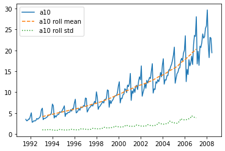
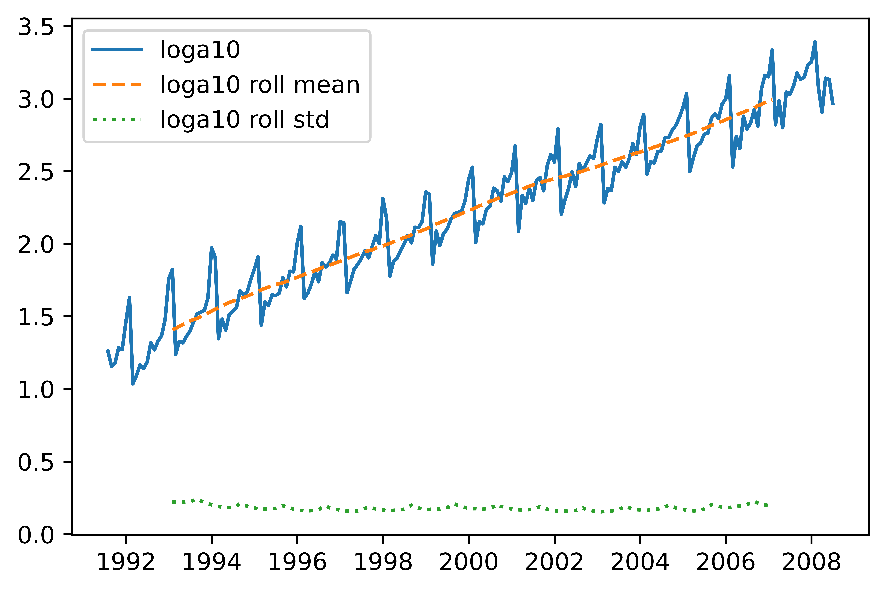
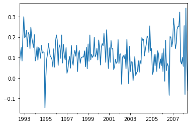

[](http://quantlet.de/)

## [](http://quantlet.de/) **pyTSA_AntiDiabetSales** [](http://quantlet.de/)

```yaml


Name of Quantlet:    'pyTSA_AntiDiabetSales'

Published in:        'Applied Time Series Analysis and Forecasting with Python'

Description:         'This Quantlet build and plots time series, log  and their rolling std of the of the anti-diabetic drug sales in Australia, as well as seasonally differenced series for the period from July 1991 to June 2008.'

Keywords:            'time series,  stationarity,  seasonality, stochastic process,  moving average, plot '

Author[New]:         Huang Changquan, Alla Petukhina

Datafile:            AntidiabeticDrugSales.csv


```







### PYTHON Code
```python

import pandas as pd
import numpy as np
from pandas.plotting import register_matplotlib_converters
import matplotlib.pyplot as plt
from statsmodels.tsa.stattools import kpss
a10 = pd.read_csv('AntidiabeticDrugSales.csv', header = None)
dates = pd.date_range(start = '1991-07', periods = len(a10), freq = 'M')
a10.index = dates; a10 = pd.Series(a10[0])
rolma10 = pd.Series.rolling(a10, window = 36, center = True).mean()
rolstda10 = pd.Series.rolling(a10, window = 36, center = True).std()
register_matplotlib_converters()
# explicitly register matplotlib converters.
plt.plot(a10, label = 'a10')
plt.plot(rolma10, label = 'a10 roll mean', linestyle = '--')
plt.plot(rolstda10, label = 'a10 roll std', linestyle = ':')
plt.legend(); plt.show()
loga10 = np.log(a10)
rolmloga10 = pd.Series.rolling(loga10, window = 36, center = True).mean()
rolstdloga10 = pd.Series.rolling(loga10, window = 36, center = True).std()
plt.plot(loga10, label = 'loga10')
plt.plot(rolmloga10, label = 'loga10 roll mean', linestyle = '--')
plt.plot(rolstdloga10, label = 'loga10 roll std', linestyle = ':')
plt.legend(); plt.show()
dloga10 = loga10.diff(12)
dloga10 = dloga10.dropna()
dloga10.plot(); plt.show()
kpss(dloga10, regression = 'c')

```

automatically created on 2022-02-09