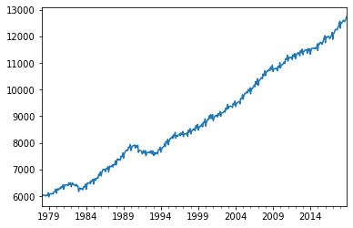
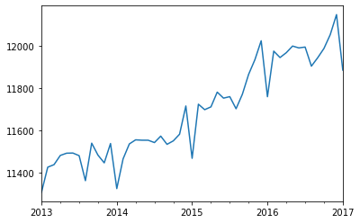
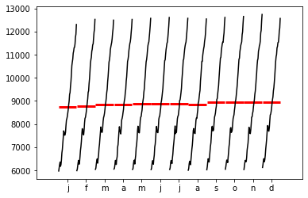
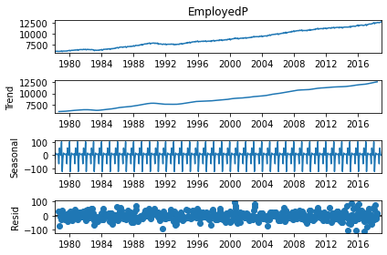

[](http://quantlet.de/)

## [](http://quantlet.de/) **pyTSA_AustralianLabour** [](http://quantlet.de/)

```yaml


Name of Quantlet:    'pyTSA_AustralianLabour'

Published in:        'Applied Time Series Analysis and Forecasting with Python'

Description:         'This Quantlet  plots time series and additive decomposition results of monthly employed total persons from February 1978 to November 2018 (in
thousands) (example 2.5, Figures 2.13-2.16 from the Book).'

Keywords:            'time series, additive decomposition, smoothing, employment, seasonality, visualisation'

Author:              Huang Changquan, Alla Petukhina

Datafile:            AustraliaEmployedTotalPersons.xlsx


```









### PYTHON Code
```python

import pandas as pd
import matplotlib.pyplot as plt
from statsmodels.graphics.tsaplots import month_plot
from statsmodels.tsa.seasonal import seasonal_decompose
from PythonTsa.plot_acf_pacf import acf_pacf_fig
aul = pd.read_excel('AustraliaEmployedTotalPersons.xlsx', header = 0)
timeindex = pd.date_range('1978-02',periods = len(aul),freq = 'M')
aul.index = timeindex
aults = aul['EmployedP']
aults.plot(); plt.show()
# Graph time series plot from 2013.1 to 2017.1
aults['2013-01':'2017-01'].plot(); plt.show()
month_plot(aults); plt.show() #Plot seasonal plots
aultsdeca = seasonal_decompose(aults, model = 'additive')
aultsdeca.plot(); plt.show()
aultsdeca.resid = aultsdeca.resid.dropna()
acf_pacf_fig(aultsdeca.resid, both = False, lag = 48)
ar = aultsdeca.resid
rolm = pd.Series.rolling(ar, window = 36, center = True).mean()
rolstd = pd.Series.rolling(ar, window = 36, center = True).std()
#plt.set_size_inches(18.5, 10.5)
plt.plot(aultsdeca.resid, label = 'dec resid')
plt.plot(rolm, label = 'resid roll mean', linestyle = '--' )
plt.plot(rolstd, label = 'resid roll std', linestyle = ':')
plt.title('Add. decom. resid. of Australian employed persons')
plt.legend(); plt.show()
```

automatically created on 2022-01-20