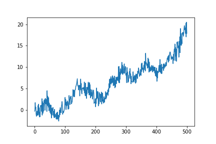
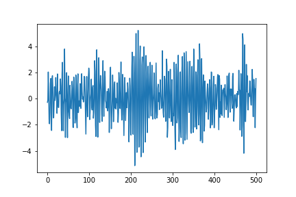

[](http://quantlet.de/)

## [](http://quantlet.de/) **pyTSA_causality** [](http://quantlet.de/)

```yaml


Name of Quantlet:    'pyTSA_causality'

Published in:        'Applied Time Series Analysis and Forecasting with Python'

Description:         'This Quantlet simulates and plots causal and noncausal AR(5) - autoregressive processes as describe in Example 3.9 in the book'

Keywords:            'time series,  stationarity, autocorrelation,  simulation, stochastic process, ARMA, moving average, autoregression, causality'

Author[New]:         Huang Changquan, Alla Petukhina


```





### PYTHON Code
```python

import numpy as np
import pandas as pd
import matplotlib.pyplot as plt
from statsmodels.tsa.arima_process import arma_generate_sample
p1 = [-0.2, -0.1, 0.1, -0.6, -0.2, 1] # AR model (i)
r1 = np.roots(p1)
r1; abs(r1)
#
p2 = [-0.2, -0.1, 0.1, 0.6, -0.2, 1] # AR model (ii)
r2 = np.roots(p2)
r2; abs(r2)
#
ar1 = np.array([1, -0.2, -0.6, 0.1, -0.1, -0.2])
np.random.seed(123457)
x1 =  arma_generate_sample(ar = ar1, ma = [1], nsample = 500)
x1 = pd.Series(x1)
x1.plot(); plt.savefig('TSP_Causality_fig3-17.png'); plt.show();
ar2 = np.array([1, -0.2, 0.6, 0.1, -0.1, -0.2])
np.random.seed(123457)
x2 = arma_generate_sample(ar = ar2, ma = [1], nsample = 500)
x2 = pd.Series(x2)
x2.plot(); plt.savefig('TSP_Causality_fig3-18.png')
```

automatically created on 2022-01-20