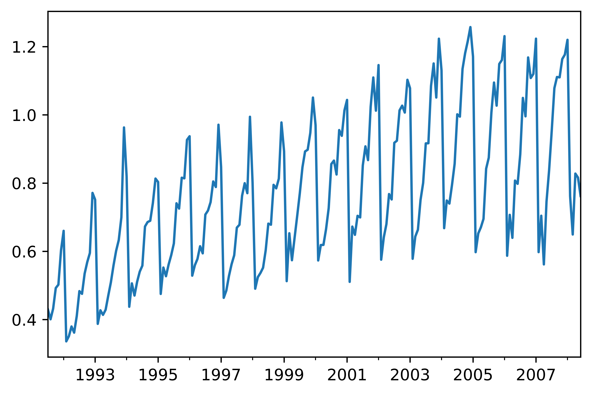
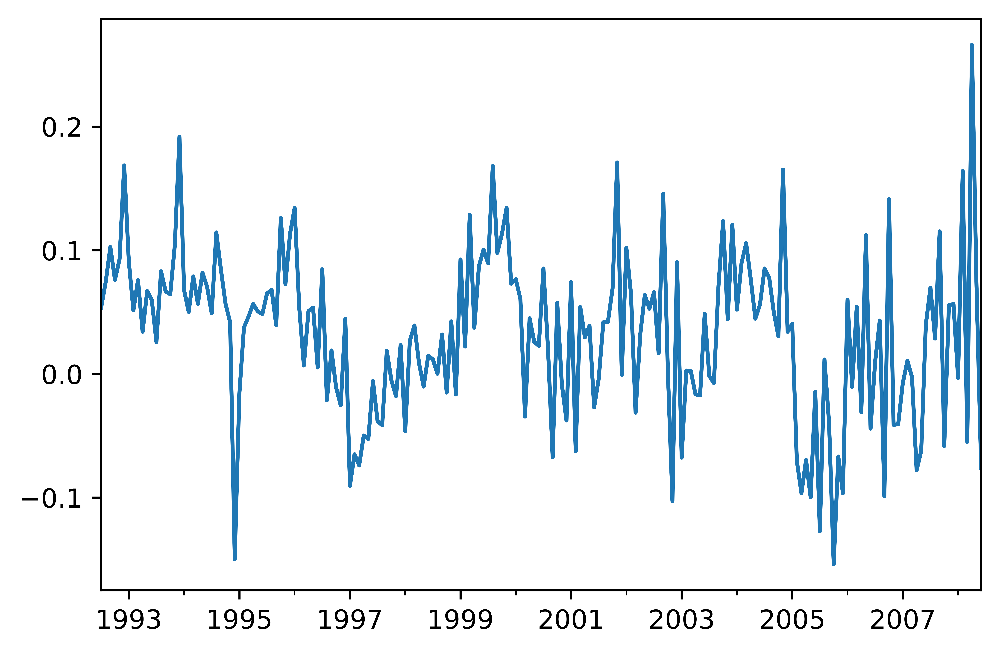
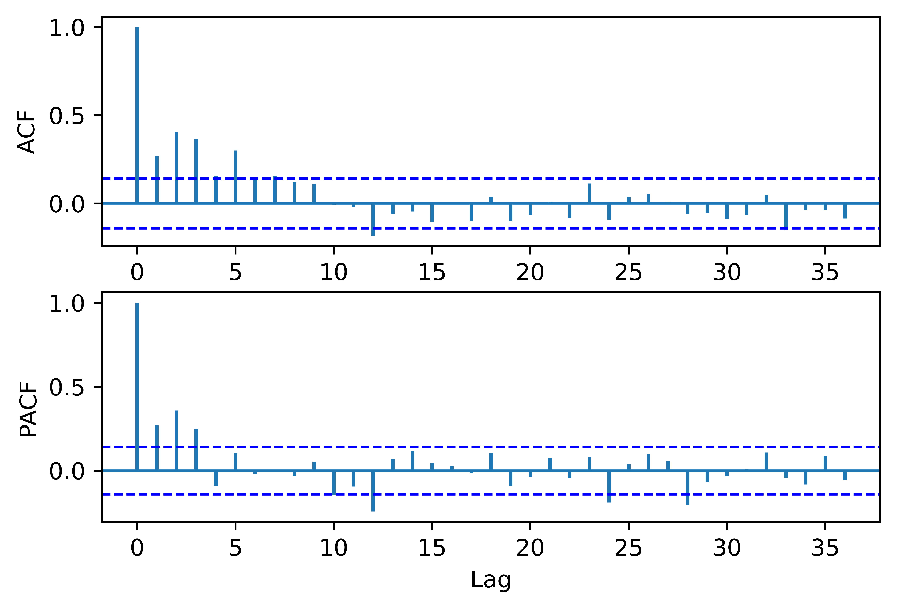

[](http://quantlet.de/)

## [](http://quantlet.de/) **pyTSA_CorticoSales** [](http://quantlet.de/)

```yaml


Name of Quantlet:    'pyTSA_CorticoSales'

Published in:        'Applied Time Series Analysis and Forecasting with Python'

Description:         'This Quantlet builds plots time series and ACF of Chinese quarterly GDP from 1992 to 2017'

Keywords:            'time series, autocorrelation, Chinese GDP, plot, visualisation'

Author:              Huang Changquan, Alla Petukhina

Datafile:            gdpquarterlychina1992.1-2017.4.csv


```








### PYTHON Code
```python

import pandas as pd
import numpy as np
import statsmodels.api as sm
import matplotlib.pyplot as plt
from PythonTsa.plot_acf_pacf import acf_pacf_fig
from PythonTsa.ModResidDiag import plot_ResidDiag
h02 = pd.read_csv('h02July1991June2008.csv', header = 0)
dates = pd.date_range(start = '1991-07', periods = len(h02), freq = 'M')
h02.index = dates
h02 = pd.Series(h02['h02'])
h02.plot(); plt.savefig('pyTSA_CorticoSales_fig5-15.png', dpi = 1200, 
             bbox_inches ='tight', transparent = True, legend = None); plt.show()
Dh02 = sm.tsa.statespace.tools.diff(h02, k_diff = 0, k_seasonal_diff = 1, 
                                    seasonal_periods = 12)
Dh02.plot(); plt.savefig('pyTSA_CorticoSales_fig5-16.png', dpi = 1200, 
             bbox_inches ='tight', transparent = True, legend = None); plt.show()
acf_pacf_fig(Dh02, both = True, lag = 36)
plt.savefig('pyTSA_CorticoSales_fig5-17.png', dpi = 1200, 
             bbox_inches ='tight', transparent = True, legend = None)
sm.tsa.kpss(Dh02, regression = 'c', lags = 'auto')
sarima005210 = sm.tsa.SARIMAX(h02, order = (0, 0, 5), easonal_order = (2, 1, 0, 12))
sarimaMod005210 = sarima005210.fit()
print(sarimaMod005210.summary())
resid005210 = sarimaMod005210.resid[12:]
plot_ResidDiag(resid005210, noestimatedcoef = 7, nolags = 48, lag = 36)
plt.savefig('pyTSA_CorticoSales_fig5-18.png', dpi = 1200, 
             bbox_inches ='tight', transparent = True, legend = None)
sarima0054210 = sm.tsa.SARIMAX(h02, order = (0, 0, [1, 1, 1, 0, 1]), 
                               seasonal_order = (2, 1, 0, 12)) # [1, 1, 1, 0, 1] means ma.L4 = 0 by default.
sarimaMod0054210 = sarima0054210.fit()
print(sarimaMod0054210.summary())
resid0054210 = sarimaMod0054210.resid[12:]
plot_ResidDiag(resid0054210, noestimatedcoef = 6, nolags = 48, lag = 36)
plt.savefig('pyTSA_CorticoSales_fig5-19.png', dpi = 1200, 
             bbox_inches ='tight', transparent = True, legend = None)
arp = [-0.2590, -0.2718, 1]
aroot = np.roots(arp)
abs(aroot)
map = [0.3496, 0, 0.5102, 0.4979, 0.2048, 1]
maroot = np.roots(map)
abs(maroot)
```

automatically created on 2022-02-28