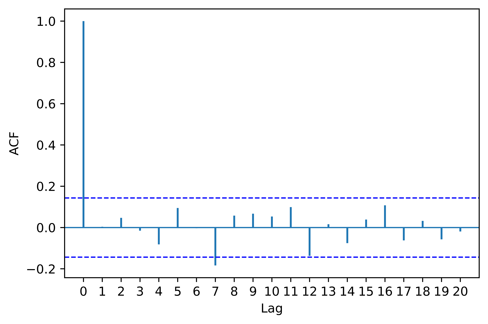
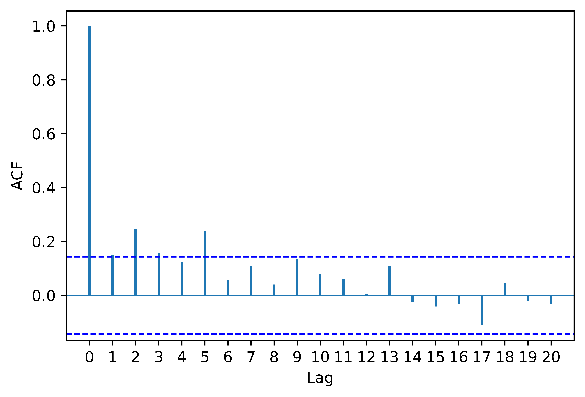

[](http://quantlet.de/)

## [](http://quantlet.de/) **pyTSA_EconUS** [](http://quantlet.de/)

```yaml


Name of Quantlet:    'pyTSA_EconUS'

Published in:        'Applied Time Series Analysis and Forecasting with Python'

Description:         'This Quantlet plots monthly time series of returns of Procter and Gamble from 1961 to 2016 and  their ACF and PACF (Example, 2.4 Figures 2.8-2.9 in the book)'

Keywords:            'time series, autocorrelation, returns, ACF, PACF, plot, visualisation'

Author:              Huang Changquan, Alla Petukhina

Datafile:            monthly returns of Procter n Gamble stock n 3 market indexes 1961 to 2016.csv


```








### PYTHON Code
```python

import pandas as pd
import matplotlib.pyplot as plt
import statsmodels.api as sm
from PythonTsa.plot_acf_pacf import acf_pacf_fig
from PythonTsa.LjungBoxtest import plot_LB_pvalue
from PythonTsa.plot_multi_ACF import multi_ACFfig
from statsmodels.tsa.statespace.sarimax import SARIMAX
from arch import arch_model
uscc = pd.read_csv('USEconomicChange.csv')
dates = pd.date_range('1970/3/31', periods = len(uscc), freq = 'Q')
uscc.index = dates
uscc = uscc.drop(columns = ['Time'])
uscc.rename(columns = {'Consumption':'cons', 'Income':'inc', 
'Production':'prod', 'Savings':'sav', 'Unemployment':'unem'}, 
inplace = True)
multi_ACFfig(uscc, nlags = 12)
plt.savefig('pyTSA_EconUS_fig8-4.png', dpi = 1200, bbox_inches ='tight', 
            transparent = True, legend = None); plt.show() 
X = uscc[['inc', 'prod', 'sav', 'unem']]
Y = uscc['cons']
X = sm.add_constant(X, prepend = False)
sarimaxmod = SARIMAX(endog = Y, exog = X, order = (1, 0, 1))
sarimaxfit = sarimaxmod.fit(disp = False)
print(sarimaxfit.summary())
sarimaxresid = sarimaxfit.resid
acf_pacf_fig(sarimaxresid, both = False, lag = 20)
plt.savefig('pyTSA_EconUS_fig8-5.png', dpi = 1200, bbox_inches ='tight', 
            transparent = True, legend = None); plt.show() 
plot_LB_pvalue(sarimaxresid, noestimatedcoef = 2, nolags = 20)
plt.savefig('pyTSA_EconUS_fig8-6.png', dpi = 1200, bbox_inches ='tight', 
            transparent = True, legend = None); plt.show() 
# the residuals are of Model (8.16b) and so noestimatedcoef = 2.
acf_pacf_fig(sarimaxresid**2, both = False, lag = 20)
plt.savefig('pyTSA_EconUS_fig8-7.png', dpi = 1200, bbox_inches ='tight', 
            transparent = True, legend = None); plt.show() 
plot_LB_pvalue(sarimaxresid**2, noestimatedcoef = 0, nolags = 20)
plt.savefig('pyTSA_EconUS_fig8-8.png', dpi = 1200, bbox_inches ='tight', 
            transparent = True, legend = None); plt.show() 
archmod = arch_model(sarimaxresid, mean = 'Zero').fit(disp = 'off')
# mean = 'Zero' means no mean equation in GARCH models.
print(archmod.summary())
archresid = archmod.std_resid
plot_LB_pvalue(archresid, noestimatedcoef = 0, nolags = 20)
plt.savefig('pyTSA_EconUS_fig8-9.png', dpi = 1200, bbox_inches ='tight', 
            transparent = True, legend = None); plt.show() 
plot_LB_pvalue(archresid**2, noestimatedcoef = 0, nolags = 20)
plt.savefig('pyTSA_EconUS_fig8-10.png', dpi = 1200, bbox_inches ='tight', 
            transparent = True, legend = None); plt.show() 
```

automatically created on 2022-02-28