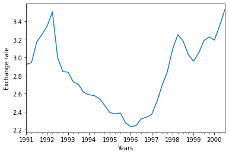

[](http://quantlet.de/)

## [](http://quantlet.de/) **pyTSA_ExRate** [](http://quantlet.de/)

```yaml


Name of Quantlet:    'pyTSA_ExRate'

Published in:        'Applied Time Series Analysis and Forecasting with Python'

Description:         'This Quantlet  plots time series and their ACF&PACF of quarterly exchange rate of GBP to NZD  for the time span from March 1991 to September 2000 (example 2.2, Figures 2.1-2.3 from the Book).'

Keywords:            'time series, autocorrelation, exchange rate, visualisation, log-returns, PACF, ACF'

Author:              Huang Changquan, Alla Petukhina

Datafile:           ExchRate NZ per UK.txt


```




### PYTHON Code
```python

import pandas as pd
import matplotlib.pyplot as plt
from statsmodels.graphics.tsaplots import plot_acf, plot_pacf
x = pd.read_table('ExchRate NZ per UK.txt', header=0)
dates = pd.date_range('1991', periods = len(x), freq = 'Q')
x.index = dates; xts = pd.Series(x['xrate'])
xts.plot(); plt.xlabel('Years')
plt.ylabel('Exchange rate'); plt.show()
# The following is to plot ACF and PACF using statsmodels
fig = plt.figure()
plot_acf(xts, lags = 17, ax = fig.add_subplot(2, 1, 1))
plot_pacf(xts, lags = 17, ax = fig.add_subplot(2, 1, 2))
fig.tight_layout(pad = 1.5)
plt.show()
# The following is to plot ACF and PACF using PythonTsa
from PythonTsa.plot_acf_pacf import acf_pacf_fig
acf_pacf_fig(xts, both = True, lag = 17)
```

automatically created on 2022-01-20