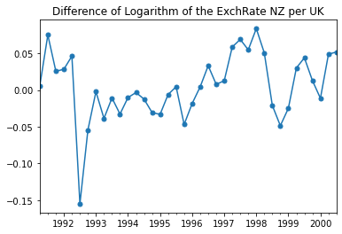
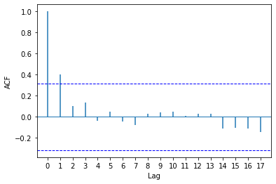
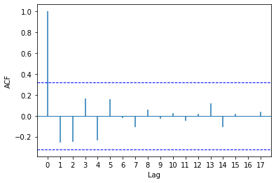

[](http://quantlet.de/)

## [](http://quantlet.de/) **pyTSA_ExRateWN** [](http://quantlet.de/)

```yaml


Name of Quantlet:    'pyTSA_ExRateWN'

Published in:        'Applied Time Series Analysis and Forecasting with Python'

Description:         'This Quantlet builds log-returns and double difference of log series for quarterly exchange rate of GBP to NZD and plots time series and their ACF   for the time span from March 1991 to September 2000 (example 2.3, Figures 2.5-2.7 from the Book)'

Keywords:            'time series, autocorrelation, exchange rate, white noise, visualisation, log-returns, Ljung-Box test, ACF'

Author:              Huang Changquan, Alla Petukhina

Datafile:            ExchRate NZ per UK.txt


```







### PYTHON Code
```python

import pandas as pd
import numpy as np
import matplotlib.pyplot as plt
#import plot_acf, plot_pacf
from statsmodels.tsa.stattools import acf
from PythonTsa.plot_acf_pacf import acf_pacf_fig
from statsmodels.stats.diagnostic import acorr_ljungbox
x = pd.read_table('ExchRate NZ per UK.txt', header=0)
dates = pd.date_range('1991', periods = len(x), freq = 'Q')
x.index = dates; xts = pd.Series(x['xrate'])
logxts = np.log(xts)
dlogxts = logxts.diff(1)
dlogxts = dlogxts.dropna() #delete "NaN"
dlogxts.plot(marker = 'o', markersize = 5)
plt.title('Difference of Logarithm of the ExchRate NZ per UK')
plt.show()
acf_pacf_fig(dlogxts, both = False, lag = 17)
r,q,p = acf(dlogxts,nlags = 35,qstat = True)
# r for ACF; q for Ljung-Box statistics; p for p-values
p
q1,p1 = acorr_ljungbox(dlogxts, lags = 35, boxpierce = False)
p1
ddlogxts = dlogxts.diff(1)
ddlogxts = ddlogxts.dropna()
acf_pacf_fig(ddlogxts, both = False, lag = 17)
r2,q2,p2 = acf(ddlogxts,nlags = 35,qstat = True)
p2
```

automatically created on 2022-01-20