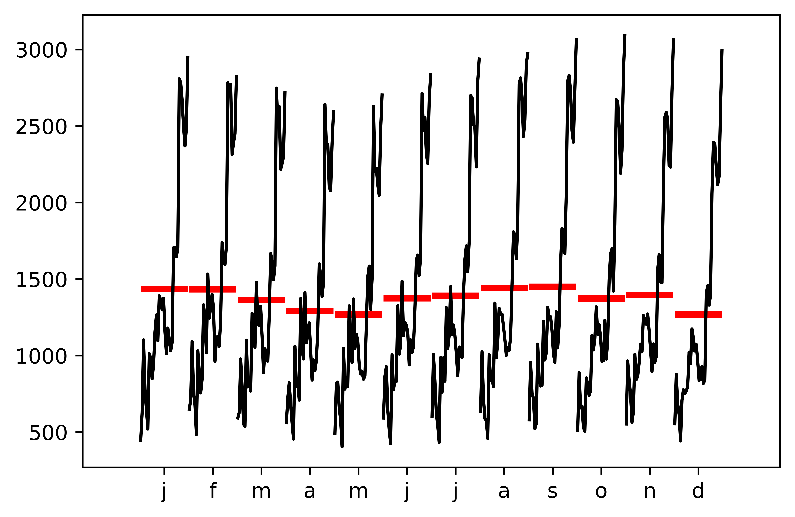
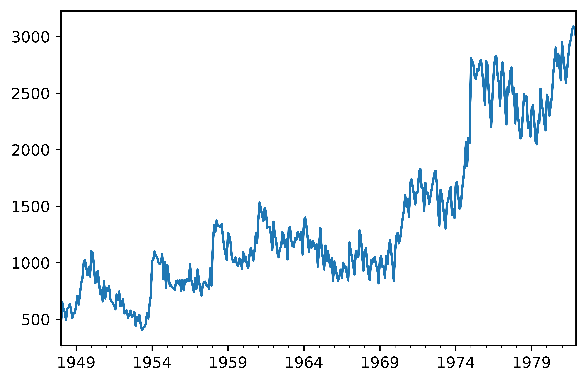
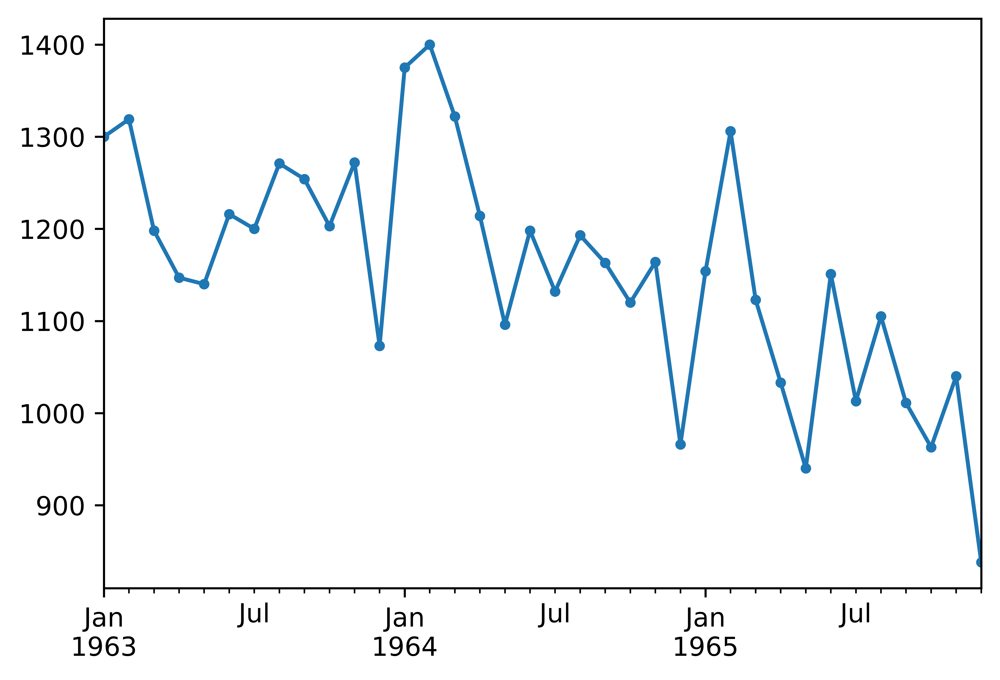
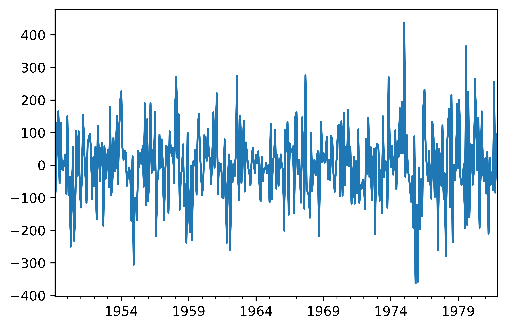
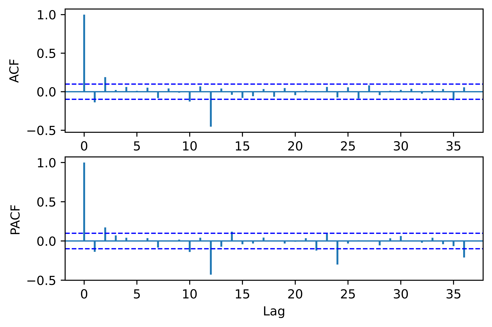

[](http://quantlet.de/)

## [](http://quantlet.de/) **pyTSA_FemaleLabor** [](http://quantlet.de/)

```yaml


Name of Quantlet:    'pyTSA_FemaleLabor'

Published in:        'Applied Time Series Analysis and Forecasting with Python'

Description:         'This Quantlet simulates ARMA(2,2) - autoregressive moving average process and draws the true ACF and PACF'

Keywords:            'time series,  stationarity, autocorrelation, PACF, ACF, simulation, stochastic process, ARMA, moving average, autoregression'

Author[New]:         Huang Changquan, Alla Petukhina


```











### PYTHON Code
```python

import pandas as pd
import statsmodels.api as sm
import matplotlib.pyplot as plt
from statsmodels.graphics.tsaplots import month_plot
from PythonTsa.plot_acf_pacf import acf_pacf_fig
x = pd.read_csv('USFemalesAged20+Job1948-81.csv', header = None)
dates  =  pd.date_range(start = '1948-01', periods = len(x), freq = 'M')
x.index = dates
x = pd.Series(x[0])
month_plot(x); 
plt.savefig('pyTSA_FemaleLabor_fig5-1.png', dpi = 1200, 
             bbox_inches ='tight', transparent = True, legend = None); plt.show()
x.plot(); 
plt.savefig('pyTSA_FemaleLabor_fig5-2.png', dpi = 1200, 
             bbox_inches ='tight', transparent = True, legend = None); plt.show()
x['1963-01' : '1965-12'].plot(marker = '.'); 
plt.savefig('pyTSA_FemaleLabor_fig5-3.png', dpi = 1200, 
             bbox_inches ='tight', transparent = True, legend = None); plt.show()
dDx = sm.tsa.statespace.tools.diff(x, k_diff = 1,
k_seasonal_diff = 1, seasonal_periods = 12)
# k_diff is the order number of the ordinary difference.
# k_seasonal_diff is the order number of the seasonal difference.
# seasonal_periods is the seasonal period.
dDx.head()
dDx.plot(); 
plt.savefig('pyTSA_FemaleLabor_fig5-4.png', dpi = 1200, 
             bbox_inches ='tight', transparent = True, legend = None); plt.show()
acf_pacf_fig(dDx, both = True, lag = 36)
plt.savefig('pyTSA_FemaleLabor_fig5-5.png', dpi = 1200, 
             bbox_inches ='tight', transparent = True, legend = None);
sm.tsa.kpss(dDx, regression = 'c', lags = 'auto')

```

automatically created on 2022-02-28