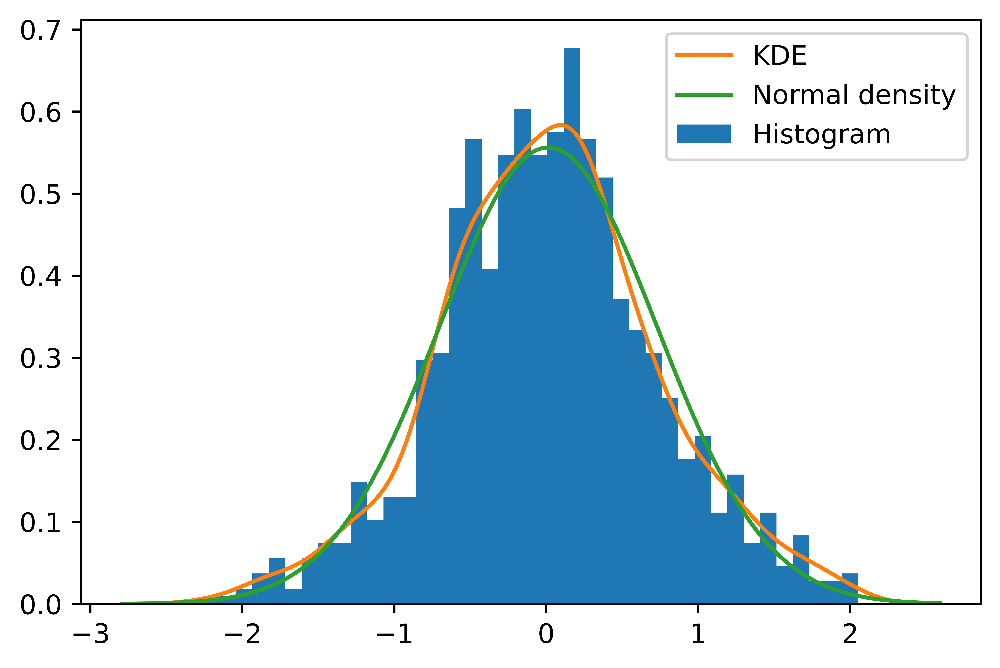
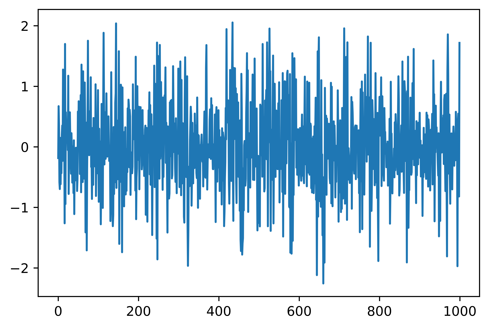
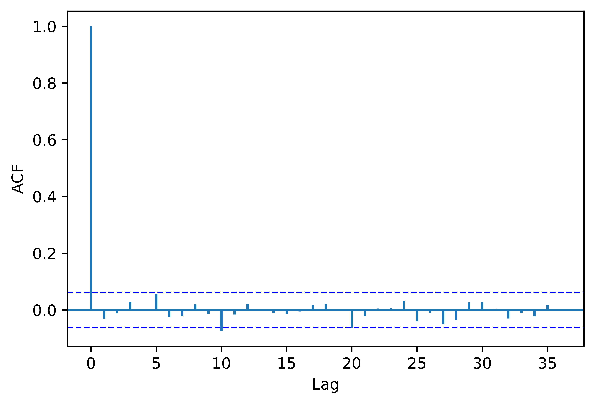

[](http://quantlet.de/)

## [](http://quantlet.de/) **pyTSA_GARCH** [](http://quantlet.de/)

```yaml


Name of Quantlet:    'pyTSA_GARCH'

Published in:        'Applied Time Series Analysis and Forecasting with Python'

Description:         'This Quantlet simulates ARMA(2,2) - autoregressive moving average process and draws the true ACF and PACF'

Keywords:            'time series,  stationarity, autocorrelation, PACF, ACF, simulation, stochastic process, ARMA, moving average, autoregression'

Author[New]:         Huang Changquan, Alla Petukhina


```









### PYTHON Code
```python

import numpy as np
import statsmodels.api as sm
import matplotlib.pyplot as plt
from arch.univariate import arch_model
from PythonTsa.plot_acf_pacf import acf_pacf_fig
from PythonTsa.LjungBoxtest import plot_LB_pvalue
from scipy.stats import norm
sim_mod  =  arch_model(None, p = 1, q = 1)
params = [0, 0.1, 0.2, 0.6] # in general, params = [r, omega, alpha, beta]
sim_data  =  sim_mod.simulate(params, nobs = 1000)
simdata = sim_data['data']
simdata.plot()
plt.savefig('pyTSA_GARCH_fig6-7.png', dpi = 1200, 
             bbox_inches ='tight', transparent = True, legend = None); plt.show()
acf_pacf_fig(simdata, both = False, lag = 36)
plt.savefig('pyTSA_GARCH_fig6-8.png', dpi = 1200, 
             bbox_inches ='tight', transparent = True, legend = None)
acf_pacf_fig(simdata**2, both = False, lag = 36)
plt.savefig('pyTSA_GARCH_fig6-9.png', dpi = 1200, 
             bbox_inches ='tight', transparent = True, legend = None)
plot_LB_pvalue(simdata, noestimatedcoef = 0, nolags = 36)
plt.savefig('pyTSA_GARCH_fig6-10.png', dpi = 1200, 
             bbox_inches ='tight', transparent = True, legend = None)
fig  =  plt.figure()
ax  =  fig.add_subplot(111)
hfig = ax.hist(simdata, bins = 40, density = True, label = 'Histogram')
kde  =  sm.nonparametric.KDEUnivariate(simdata)
kde.fit()
ax.plot(kde.support, kde.density, label = 'KDE')
smean = np.mean(simdata)
scal = np.std(simdata, ddof = 1)
normden = norm.pdf(kde.support, loc = smean, scale = scal)
ax.plot(kde.support, normden, label = 'Normal density')
ax.legend(loc = 'best')
plt.savefig('pyTSA_GARCH_fig6-11.png', dpi = 1200, 
             bbox_inches ='tight', transparent = True, legend = None); plt.show()
```

automatically created on 2022-02-28