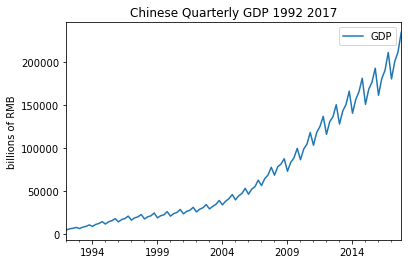

[](http://quantlet.de/)

## [](http://quantlet.de/) **pyTSA_GDPChina** [](http://quantlet.de/)

```yaml


Name of Quantlet:    'pyTSA_GDPChina'

Published in:        'Applied Time Series Analysis and Forecasting with Python'

Description:         'This Quantlet builds plots time series and ACF of Chinese quarterly GDP from 1992 to 2017'

Keywords:            'time series, autocorrelation, Chinese GDP, plot, visualisation'

Author:              Huang Changquan, Alla Petukhina

Datafile:            gdpquarterlychina1992.1-2017.4.csv


```



### PYTHON Code
```python

import pandas as pd
#import numpy as np
x = pd.read_csv('gdpquarterlychina1992.1-2017.4.csv', header = 0) 
dates = pd.date_range(start='1992', periods = len(x), freq='Q')
x.index = dates
import matplotlib.pyplot as plt
x.plot(); plt.title('Chinese Quarterly GDP 1992 2017')
plt.ylabel('billions of RMB'); plt.show()
from PythonTsa.plot_acf_pacf import acf_pacf_fig
acf_pacf_fig(x, both = False, lag = 60)
```

automatically created on 2022-01-20