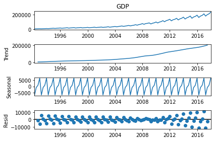
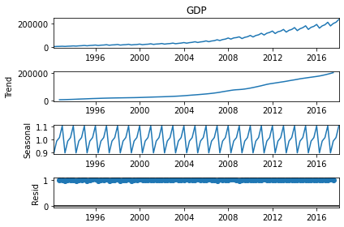
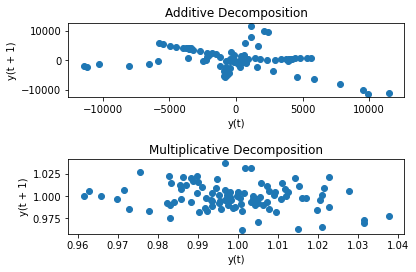

[](http://quantlet.de/)

## [](http://quantlet.de/) **pyTSA_GDPChinaDecomposition** [](http://quantlet.de/)

```yaml


Name of Quantlet:    'pyTSA_GDPChinaDecomposition'

Published in:        'Applied Time Series Analysis and Forecasting with Python'

Description:         'This Quantlet performs additive and multiplicative decomposition of Chinese quarterly GDP from 1992 to 2017 and  plots results (Figures 2.21-2.23 in the book)'

Keywords:            'time series, autocorrelation, Chinese GDP, plot, visualisation'

Author:              Huang Changquan, Alla Petukhina

Datafile:            gdpquarterlychina1992.1-2017.4.csv


```







### PYTHON Code
```python

import pandas as pd
from statsmodels.tsa.seasonal import seasonal_decompose
import matplotlib.pyplot as plt
from pandas.plotting import lag_plot
from PythonTsa.plot_acf_pacf import acf_pacf_fig
from statsmodels.tsa.stattools import acf
from statsmodels.tsa.holtwinters import ExponentialSmoothing
x = pd.read_csv('gdpquarterlychina1992.1-2017.4.csv', header = 0) 
dates = pd.date_range(start = '1992', periods = len(x), freq = 'Q')
x.index = dates
x = pd.Series(x['GDP'])
xdeca = seasonal_decompose(x, model = 'additive')
xdecm = seasonal_decompose(x, model = 'multiplicative')
xdeca.plot(); plt.show()
xdecm.plot(); plt.show()
fig = plt.figure()
lag_plot(xdeca.resid, ax = fig.add_subplot(211))
plt.title('Additive Decomposition')
lag_plot(xdecm.resid, ax = fig.add_subplot(212))
plt.title('Multiplicative Decomposition')
#fig.set_size_inches(18.5, 10.5)
fig.tight_layout(pad = 1.5)
plt.show()
xdecm.resid = xdecm.resid.dropna()
acf_pacf_fig(xdecm.resid, both = False, lag = 20)
xhwfit = ExponentialSmoothing(x,trend = 'add',seasonal = 'add', seasonal_periods = 4).fit()
ax1 = plt.subplot(411);x.plot();
plt.setp(ax1.get_xticklabels(),visible = False); 
plt.ylabel('GDP')
ax2 = plt.subplot(412,sharex = ax1);xhwfit.level.plot();
plt.setp(ax2.get_xticklabels(),visible = False); plt.ylabel('Level')
ax3 = plt.subplot(413,sharex = ax1);xhwfit.slope.plot();
plt.setp(ax3.get_xticklabels(),visible = False); plt.ylabel('Slope')
ax4 = plt.subplot(414, sharex = ax1); xhwfit.season.plot();
plt.ylabel('Season') 
fig.set_size_inches(18.5, 10.5)
fig.tight_layout(pad = 1.5)
plt.show()
xhwfit.resid.plot(); plt.show()
lag_plot(xhwfit.resid); plt.show()
acf_pacf_fig(xhwfit.resid, both = False, lag = 20)
y = xhwfit.forecast(4)
y
z = xhwfit.predict(start = '1992-03-31',end = '2018-12-31')
z = pd.DataFrame(z,columns = {'Predict'})
zx = z.join(x)
Predict, = plt.plot(zx['Predict'],marker = '.',label = 'Predict')
GDP, = plt.plot(zx['GDP'], linewidth = 1.0, label = 'GDP')
plt.title('Chinese Quarterly GDP and Predict')
plt.legend(handles = [Predict, GDP]); plt.show()
#fig.set_size_inches(18.5, 10.5)
fig.tight_layout(pad = 1.5)
r,q,p = acf(xhwfit.resid,qstat = True, nlags = 20)
p
```

automatically created on 2022-01-20