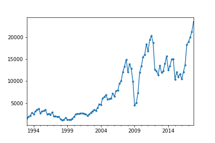
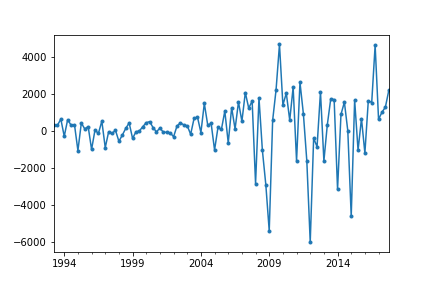
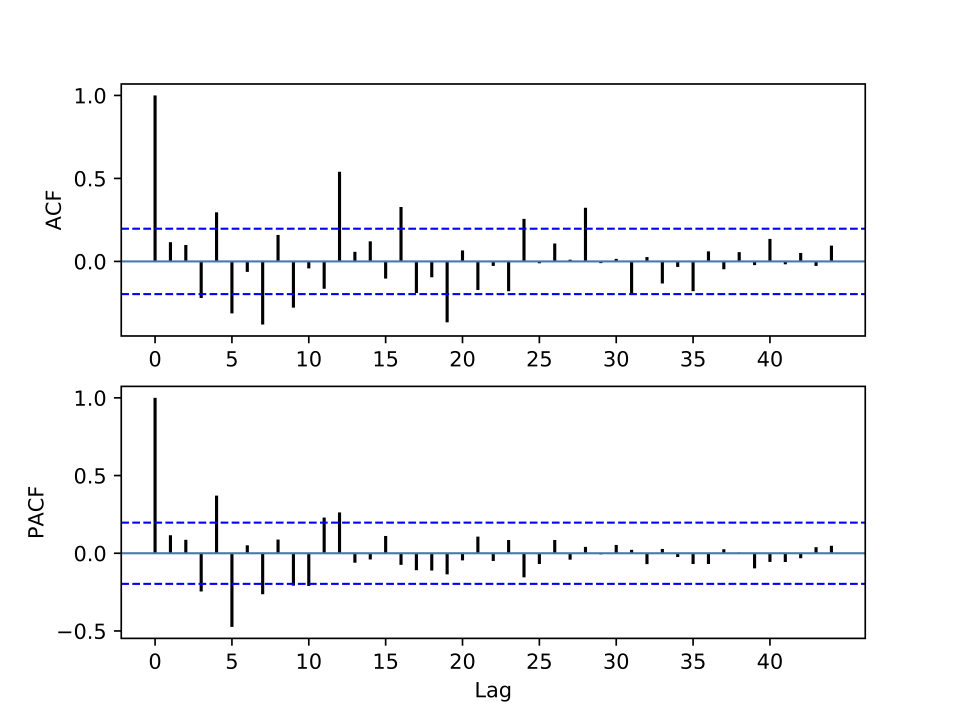

[](http://quantlet.de/)

## [](http://quantlet.de/) **pyTSA_GDPChinaDiff** [](http://quantlet.de/)

```yaml


Name of Quantlet:    'pyTSA_GDPChinaDiff'

Published in:        'Applied Time Series Analysis and Forecasting with Python'

Description:         'This Quantlet produces and plot time series of seasonally and firstly differenced Chinese quarterly GDP and its ACF for the period from 1992 to 2017.'

Keywords:            'time series, seasonality, stationarity, autocorrelation, KPSS, ACF'

Author[New]:         Huang Changquan, Alla Petukhina

Datafile:            gdpquarterlychina1992.1-2017.4.csv


```







### PYTHON Code
```python

import pandas as pd
import matplotlib.pyplot as plt
from PythonTsa.plot_acf_pacf import acf_pacf_fig
from statsmodels.tsa.stattools import kpss
x = pd.read_csv('gdpquarterlychina1992.1-2017.4.csv', header = 0)
dates = pd.date_range(start = '1992', periods = len(x), freq = 'Q')
x.index = dates; x = pd.Series(x['GDP'])
dx = x.diff(4) # seasonal differencing
dx = dx.dropna()
dx.plot(marker = 'o', ms = 3) # ms means marker size
plt.savefig('TSP_GDPChinaDediff_fig3-4.png'); plt.show()
d1dx = dx.diff(1)
d1dx = d1dx.dropna()
d1dx.plot(marker = 'o', ms = 3); 
plt.savefig('TSP_GDPChinaDediff_fig3-5.png'); plt.show()
acf_pacf_fig(d1dx, both = False, lag = 44)
kpss(d1dx, regression = 'c')
#InterpolationWarning: p-value is greater than the indicated p-value
#(0.20253789040706957, 0.1, 12, 
#{'10%': 0.347, '5%': 0.463, '2.5%': 0.574, '1%': 0.739})
```

automatically created on 2022-01-20