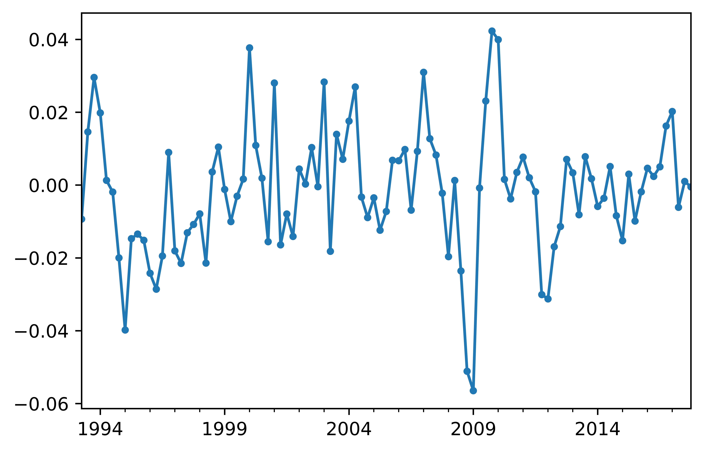
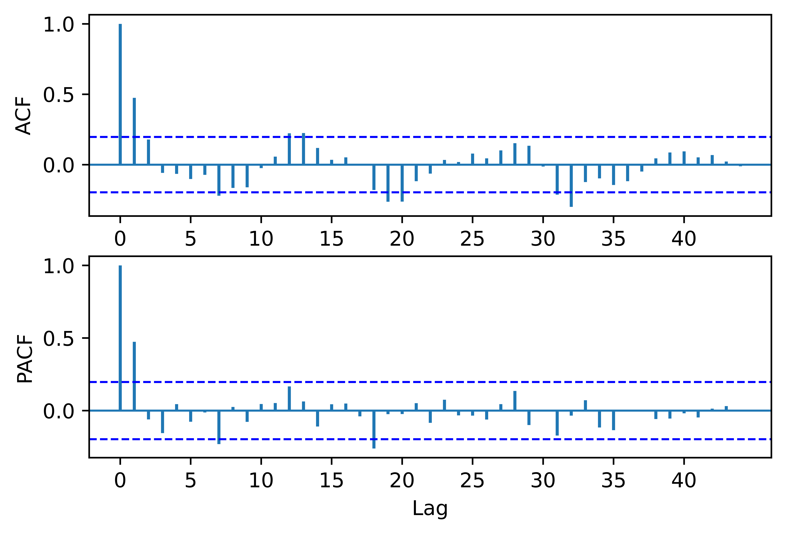

[](http://quantlet.de/)

## [](http://quantlet.de/) **pyTSA_GDPChinaSARIMA** [](http://quantlet.de/)

```yaml


Name of Quantlet:    'pyTSA_GDPChinaSARIMA'

Published in:        'Applied Time Series Analysis and Forecasting with Python'

Description:         'This Quantlet builds plots time series and ACF of Chinese quarterly GDP from 1992 to 2017'

Keywords:            'time series, autocorrelation, Chinese GDP, plot, visualisation'

Author:              Huang Changquan, Alla Petukhina

Datafile:            gdpquarterlychina1992.1-2017.4.csv


```






### PYTHON Code
```python

import pandas as pd
import numpy as np
import statsmodels.api as sm
import matplotlib.pyplot as plt
from PythonTsa.plot_acf_pacf import acf_pacf_fig
from PythonTsa.ModResidDiag import plot_ResidDiag
x = pd.read_csv('gdpquarterlychina1992.1-2017.4.csv', header = 0)
dates = pd.date_range(start = '1992', periods = len(x), freq = 'Q')
x.index = dates
x = pd.Series(x['GDP'])
lx = np.log(x)
dDlx = sm.tsa.statespace.tools.diff(lx, k_diff = 1, 
k_seasonal_diff = 1, seasonal_periods = 4)
dDlx.plot(marker = 'o', ms = 3); 
plt.savefig('pyTSA_GDPChinaSARIMA_fig5-12.png', dpi = 1200, 
             bbox_inches ='tight', transparent = True, legend = None); plt.show()
acf_pacf_fig(dDlx, both = True, lag = 44)
plt.savefig('pyTSA_GDPChinaSARIMA_fig5-13.png', dpi = 1200, 
             bbox_inches ='tight', transparent = True, legend = None);
sm.tsa.kpss(dDlx, regression = 'c', lags = 'auto')
sarima0200 = sm.tsa.SARIMAX(lx, order = (0, 1, 2), 
seasonal_order = (0, 1, 0, 4))
sarimaRes0200 = sarima0200.fit()
print(sarimaRes0200.summary())
resid0200 = sarimaRes0200.resid[5:]
# drop 1+4 = 5 residuals at head.
plot_ResidDiag(resid0200, noestimatedcoef = 2, nolags = 28, lag = 32)
plt.savefig('pyTSA_GDPChinaSARIMA_fig5-14.png', dpi = 1200, 
             bbox_inches ='tight', transparent = True, legend = None);
fore0200 = sarimaRes0200.predict(start = '2018-03-31', end = '2018-12-31')
np.exp(fore0200)
```

automatically created on 2022-02-28