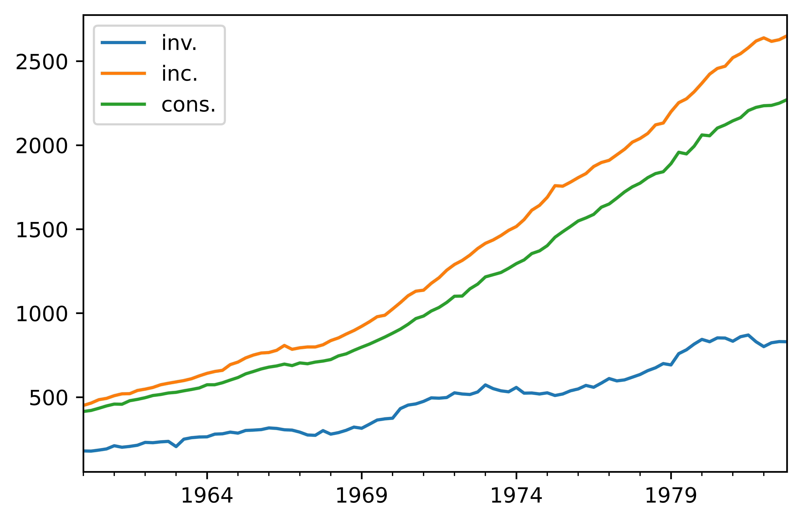
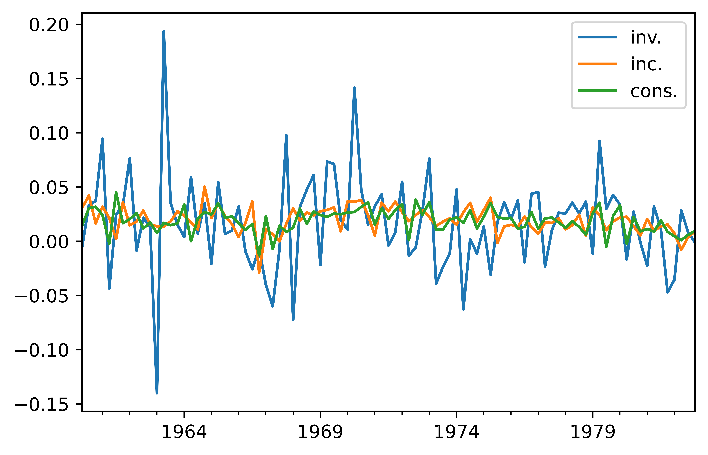

[](http://quantlet.de/)

## [](http://quantlet.de/) **pyTSA_MacroDE** [](http://quantlet.de/)

```yaml


Name of Quantlet:    'pyTSA_MacroDE'

Published in:        'Applied Time Series Analysis and Forecasting with Python'

Description:         'This Quantlet plots monthly time series of returns of Procter and Gamble from 1961 to 2016 and  their ACF and PACF (Example, 2.4 Figures 2.8-2.9 in the book)'

Keywords:            'time series, autocorrelation, returns, ACF, PACF, plot, visualisation'

Author:              Huang Changquan, Alla Petukhina

Datafile:            monthly returns of Procter n Gamble stock n 3 market indexes 1961 to 2016.csv


```






### PYTHON Code
```python

import numpy as np
import pandas as pd
import matplotlib.pyplot as plt
from statsmodels.tsa.api import VAR
from PythonTsa.plot_multi_ACF import multi_ACFfig
from PythonTsa.plot_multi_Q_pvalue import MultiQpvalue_plot
gEco = pd.read_csv('EconGermany.dat', header = 0, sep = '\s+')
# Extension name of the data is dat, not csv or txt.
# argument sep = '\s+' needed.
dates = pd.date_range('1960-03', periods = len(gEco), freq = 'Q')
gEco.index = dates
gEco = gEco[['inv.', 'inc.', 'cons.']]
gEco.plot()
plt.savefig('pyTSA_MacroDE_fig7-10.png', dpi = 1200, bbox_inches ='tight', 
            transparent = True, legend = None); plt.show() 
dlge = np.log(gEco).diff(1).dropna()
dlge.plot()
plt.savefig('pyTSA_MacroDE_fig7-11.png', dpi = 1200, bbox_inches ='tight', 
            transparent = True, legend = None); plt.show() 
dlge.tail(4)
dlgem = dlge['1960-06-30':'1981-12-31']
# leave the last four data for forecasting comparison
dlgem.tail(4)
multi_ACFfig(dlgem, nlags = 10)
plt.savefig('pyTSA_MacroDE_fig7-12.png', dpi = 1200, bbox_inches ='tight', 
            transparent = True, legend = None); plt.show() 
dlgemMod = VAR(dlgem)
print(dlgemMod.select_order(maxlags = 4))
print(dlgemMod.select_order(maxlags = 9))
dlgemRes = dlgemMod.fit(maxlags = 2, ic = None, trend = 'c')
# ic = None since the order has been selected.
print(dlgemRes.summary())
dlgemRes.is_stable()
resid = dlgemRes.resid
multi_ACFfig(resid, nlags = 10)
plt.savefig('pyTSA_MacroDE_fig7-13.png', dpi = 1200, bbox_inches ='tight', 
            transparent = True, legend = None); plt.show() 
q, p = MultiQpvalue_plot(resid, p = 2, q = 0, noestimatedcoef = 18, nolags = 24)
plt.savefig('pyTSA_MacroDE_fig7-14.png', dpi = 1200, bbox_inches ='tight', 
            transparent = True, legend = None); plt.show() 
coefMat = dlgemRes.coefs
coefMat
sigma_u = dlgemRes.sigma_u
sigma_u
dlgem = dlgem.values
# transferred to 'numpy.ndarray' class
type(dlgem)
# for forecast, the data needs to belong to the class 'ndarray'
fore_interval = dlgemRes.forecast_interval(dlgem, steps = 4)
point, lower, upper = dlgemRes.forecast_interval(dlgem, steps = 4)
point
lower
upper
dlgemRes.plot_forecast(steps = 4)
plt.savefig('pyTSA_MacroDE_fig7-15.png', dpi = 1200, bbox_inches ='tight', 
            transparent = True, legend = None); plt.show() ; plt.show()
g1 = dlgemRes.test_causality(caused = 'cons.', causing = 'inc.', 
kind = 'f', signif = 0.05)
print(g1)
g2 = dlgemRes.test_causality(caused = 'inc.', causing = 'cons.', 
kind = 'f', signif = 0.05)
print(g2)
irf = dlgemRes.irf(periods = 10)
irf.plot(); plt.savefig('pyTSA_MacroDE_fig7-16.png', dpi = 1200, bbox_inches ='tight', 
            transparent = True, legend = None); plt.show()
irf.plot_cum_effects()
plt.savefig('pyTSA_MacroDE_fig7-17.png', dpi = 1200, bbox_inches ='tight', 
            transparent = True, legend = None); plt.show() 
```

automatically created on 2022-02-28