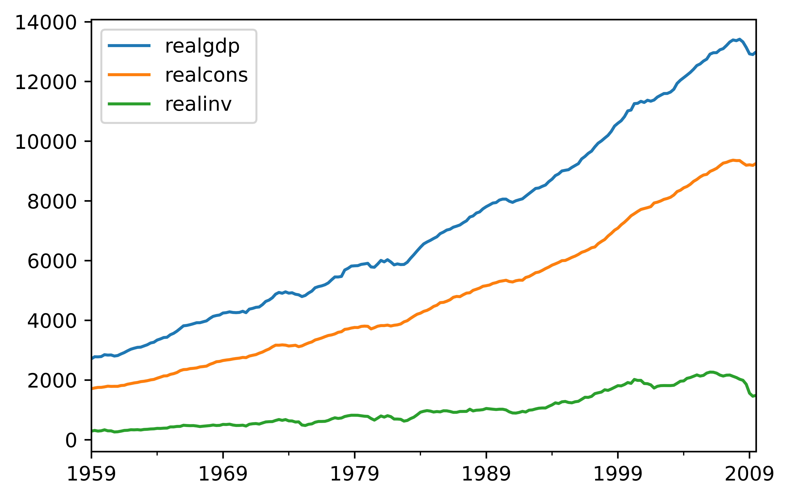
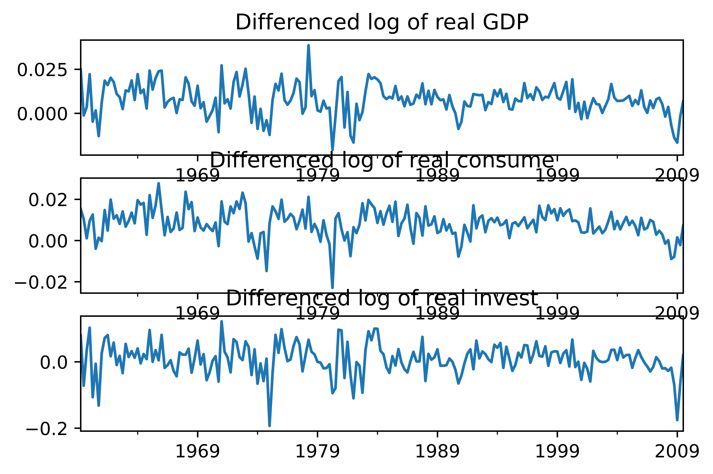

[](http://quantlet.de/)

## [](http://quantlet.de/) **pyTSA_MacroUS** [](http://quantlet.de/)

```yaml


Name of Quantlet:    'pyTSA_MacroUS'

Published in:        'Applied Time Series Analysis and Forecasting with Python'

Description:         'This Quantlet plots monthly time series of returns of Procter and Gamble from 1961 to 2016 and  their ACF and PACF (Example, 2.4 Figures 2.8-2.9 in the book)'

Keywords:            'time series, autocorrelation, returns, ACF, PACF, plot, visualisation'

Author:              Huang Changquan, Alla Petukhina

Datafile:            monthly returns of Procter n Gamble stock n 3 market indexes 1961 to 2016.csv


```






### PYTHON Code
```python

import numpy as np
import pandas as pd
import matplotlib.pyplot as plt
from statsmodels.tsa.api import VAR
from statsmodels.tsa.api import VARMAX
import statsmodels.api as sm
from PythonTsa.plot_multi_ACF import multi_ACFfig
from PythonTsa.plot_multi_Q_pvalue import MultiQpvalue_plot
mdata = sm.datasets.macrodata.load_pandas().data
mdata = mdata[['realgdp', 'realcons', 'realinv']]
dates = pd.date_range('1959-01', periods = len(mdata), freq = 'Q')
mdata.index = dates
mdata.plot()
plt.savefig('pyTSA_MacroUS_fig7-18.png', dpi = 1200, bbox_inches ='tight', 
            transparent = True, legend = None); plt.show() 
dLdata = np.log(mdata).diff(1).dropna()
# log, difference and then drop NAN
fig = plt.figure()
dLdata['realgdp'].plot(ax = fig.add_subplot(311))
plt.title('Differenced log of real GDP')
dLdata['realcons'].plot(ax = fig.add_subplot(312))
plt.title('Differenced log of real consume')
dLdata['realinv'].plot(ax = fig.add_subplot(313))
plt.title('Differenced log of real invest')
plt.savefig('pyTSA_MacroUS_fig7-19.png', dpi = 1200, bbox_inches ='tight', 
            transparent = True, legend = None); plt.show() 
dLdata.tail(3)
myd = dLdata['1959-06-30' : '2008-12-31']
# leave the last three data for forecasting comparison
myd.tail(4)
multi_ACFfig(myd, nlags = 10)
plt.savefig('pyTSA_MacroUS_fig7-20.png', dpi = 1200, bbox_inches ='tight', 
            transparent = True, legend = None); plt.show() 
mydmod1 = VAR(myd)
print(mydmod1.select_order(maxlags = 10))
print(mydmod1.select_order(maxlags = 11))
# here select p = 3 for VAR(p).
mydmod = VARMAX(myd, order = (3, 0), enforce_stationarity = True)
modfit = mydmod.fit()
print(modfit.summary())
resid = modfit.resid
multi_ACFfig(resid, nlags = 10)
plt.savefig('pyTSA_MacroUS_fig7-21.png', dpi = 1200, bbox_inches ='tight', 
            transparent = True, legend = None); plt.show() 
qs, pv = MultiQpvalue_plot(resid, p = 3, q = 0, noestimatedcoef = 27, nolags = 24)
plt.savefig('pyTSA_MacroUS_fig7-22.png', dpi = 1200, bbox_inches ='tight', 
            transparent = True, legend = None); plt.show() 
param = mydmod.param_names
mydmodf = VARMAX(myd, order = (3, 0), enforce_stationarity = False)
# Cannot fix individual autoregressive parameters when
# ‘enforce_stationarity = True‘. In this case, must either
# fix all autoregressive parameters or none.
with mydmodf.fix_params({param[0]: 0.0, param[5]: 0.0, 
                         param[6]: 0.0, param[8]: 0.0, 
                         param[9]: 0.0, param[11]: 0.0,
                         param[12]: 0.0, param[14]: 0.0,
                         param[15]: 0.0, param[17]: 0.0, 
                         param[24]: 0.0, param[26]: 0.0, 
                         param[27]: 0.0, param[28]: 0.0, 
                         param[29]: 0.0}): modff = mydmodf.fit(method = 'bfgs')
print(modff.summary())
residf = modff.resid
multi_ACFfig(residf, nlags = 10)
plt.savefig('pyTSA_MacroUS_fig7-23.png', dpi = 1200, bbox_inches ='tight', 
            transparent = True, legend = None); plt.show() 
qs, pv = MultiQpvalue_plot(residf, p = 3, q = 0, noestimatedcoef = 13, nolags = 24)
plt.savefig('pyTSA_MacroUS_fig7-24.png', dpi = 1200, bbox_inches ='tight', 
            transparent = True, legend = None); plt.show() 
fore = modff.predict(end = '2009-09-30')
realgdpFitgdp = pd.DataFrame({'realgdp':dLdata['realgdp'], 'fittedgdp':fore['realgdp']})
realconsFitcons = pd.DataFrame({'realcons':dLdata['realcons'], 'fittedcons':fore['realcons']})
realinvFitinv = pd.DataFrame({'realinv':dLdata['realinv'], 'fittedinv':fore['realinv']})
fig = plt.figure()
realgdpFitgdp.plot(style = ['-', '--'], ax = fig.add_subplot(311))
realconsFitcons.plot(style = ['-', '--'], ax = fig.add_subplot(312))
realinvFitinv.plot(style = ['-', '--'], ax = fig.add_subplot(313))
plt.savefig('pyTSA_MacroUS_fig7-25.png', dpi = 1200, bbox_inches ='tight', 
            transparent = True, legend = None); plt.show() 
```

automatically created on 2022-02-28