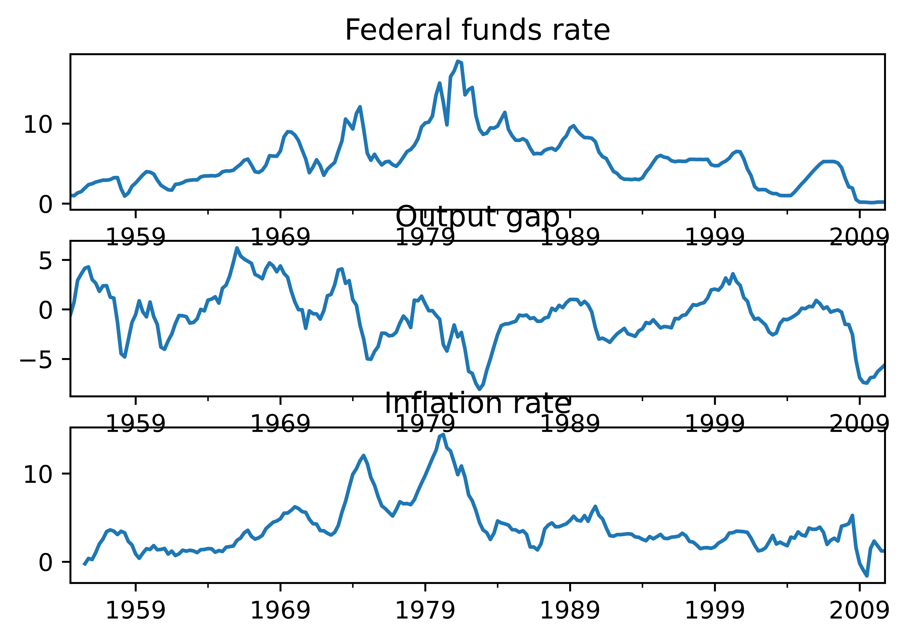
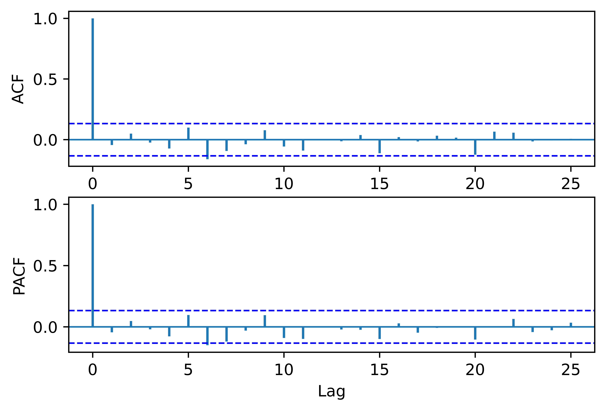

[](http://quantlet.de/)

## [](http://quantlet.de/) **pyTSA_MacroUS2** [](http://quantlet.de/)

```yaml


Name of Quantlet:    'pyTSA_MacroUS2'

Published in:        'Applied Time Series Analysis and Forecasting with Python'

Description:         'This Quantlet plots monthly time series of returns of Procter and Gamble from 1961 to 2016 and  their ACF and PACF (Example, 2.4 Figures 2.8-2.9 in the book)'

Keywords:            'time series, autocorrelation, returns, ACF, PACF, plot, visualisation'

Author:              Huang Changquan, Alla Petukhina

Datafile:            monthly returns of Procter n Gamble stock n 3 market indexes 1961 to 2016.csv


```






### PYTHON Code
```python

import pandas as pd
import statsmodels.api as sm
import matplotlib.pyplot as plt
from PythonTsa.plot_acf_pacf import acf_pacf_fig
from PythonTsa.LjungBoxtest import plot_LB_pvalue
from statsmodels.tsa.regime_switching.tests.test_markov_regression import fedfunds, ogap, inf
index = pd.date_range('1954-07-01', '2010-10-01', freq = 'QS')
dta_fedfunds  =  pd.Series(fedfunds, index = index)
dta_ogap  =  pd.Series(ogap, index = index)
dta_inf  =  pd.Series(inf, index = index)
dta_inf.head()
fig  =  plt.figure()
dta_fedfunds.plot(ax = fig.add_subplot(311))
plt.title("Federal funds rate")
dta_ogap.plot(ax = fig.add_subplot(312))
plt.title("Output gap")
dta_inf.plot(ax = fig.add_subplot(313))
plt.title("Inflation rate")
plt.savefig('pyTSA_MacroUS2_fig8-14.png', dpi = 1200, bbox_inches ='tight', 
            transparent = True, legend = None); plt.show() 
exog1 = pd.concat((dta_ogap, dta_inf), axis = 1).iloc[4:]
mymod_fedfunds = sm.tsa.MarkovAutoregression(
dta_fedfunds.iloc[4:], k_regimes = 2, order = 4, exog = exog1)
myres_fedfunds = mymod_fedfunds.fit()
print(myres_fedfunds.summary())
myresid = myres_fedfunds.resid
acf_pacf_fig(myresid, both = True, lag = 25)
plt.savefig('pyTSA_MacroUS2_fig8-15.png', dpi = 1200, bbox_inches ='tight', 
            transparent = True, legend = None); plt.show() 
plot_LB_pvalue(myresid, noestimatedcoef = 0, nolags = 25)
plt.savefig('pyTSA_MacroUS2_fig8-16.png', dpi = 1200, bbox_inches ='tight', 
            transparent = True, legend = None); plt.show() 
fig = plt.figure()
ax1 = fig.add_subplot(211)
myres_fedfunds.smoothed_marginal_probabilities[0].plot(ax = ax1)
plt.title('Smoothed probabilities of being in the high federal funds rate regime')
ax2 = fig.add_subplot(212)
myres_fedfunds.smoothed_marginal_probabilities[1].plot(ax = ax2)
plt.title('Smoothed probabilities of being in the low federal funds rate regime')
plt.savefig('pyTSA_MacroUS2_fig8-17.png', dpi = 1200, bbox_inches ='tight', 
            transparent = True, legend = None); plt.show() 
print(myres_fedfunds.expected_durations)
```

automatically created on 2022-02-28