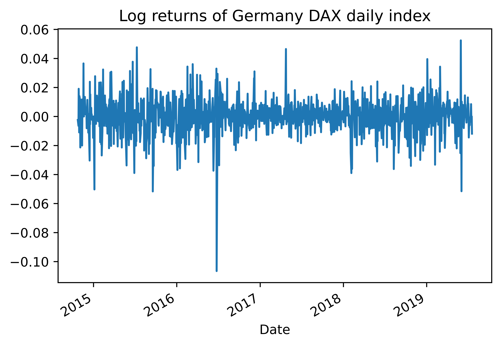
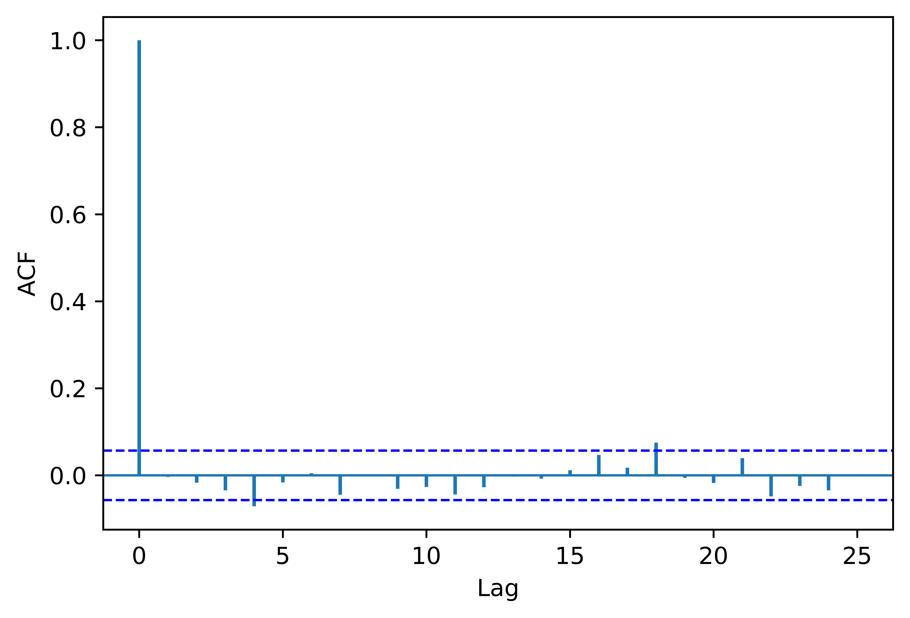

[](http://quantlet.de/)

## [](http://quantlet.de/) **pyTSA_MarkovReturnsDAX** [](http://quantlet.de/)

```yaml


Name of Quantlet:    'pyTSA_MarkovReturnsDAX'

Published in:        'Applied Time Series Analysis and Forecasting with Python'

Description:         'This Quantlet plots monthly time series of returns of Procter and Gamble from 1961 to 2016 and  their ACF and PACF (Example, 2.4 Figures 2.8-2.9 in the book)'

Keywords:            'time series, autocorrelation, returns, ACF, PACF, plot, visualisation'

Author:              Huang Changquan, Alla Petukhina

Datafile:            monthly returns of Procter n Gamble stock n 3 market indexes 1961 to 2016.csv


```






### PYTHON Code
```python

import pandas as pd
import statsmodels.api as sm
import matplotlib.pyplot as plt
from PythonTsa.plot_acf_pacf import acf_pacf_fig
from PythonTsa.LjungBoxtest import plot_LB_pvalue
daxlogret = pd.read_csv('DAXlogret.csv', header = 0)
daxlogret.index = pd.DatetimeIndex(daxlogret.Date)
logret = daxlogret.Logret
logret.plot(title = 'Log returns of Germany DAX daily index')
plt.savefig('pyTSA_MarkovReturnsDAX_fig8-11.png', dpi = 1200, bbox_inches ='tight', 
            transparent = True, legend = None); plt.show() 
mod = sm.tsa.MarkovAutoregression(logret, k_regimes = 2, order = 1, switching_variance = True)
modfit = mod.fit()
print(modfit.summary())
modresid = modfit.resid
acf_pacf_fig(modresid, both = False, lag = 25)
plt.savefig('pyTSA_MarkovReturnsDAX_fig8-12.png', dpi = 1200, bbox_inches ='tight', 
            transparent = True, legend = None); plt.show() 
plot_LB_pvalue(modresid, noestimatedcoef = 0, nolags = 25)
plt.savefig('pyTSA_MarkovReturnsDAX_fig8-13.png', dpi = 1200, bbox_inches ='tight', 
            transparent = True, legend = None); plt.show() 
```

automatically created on 2022-02-28