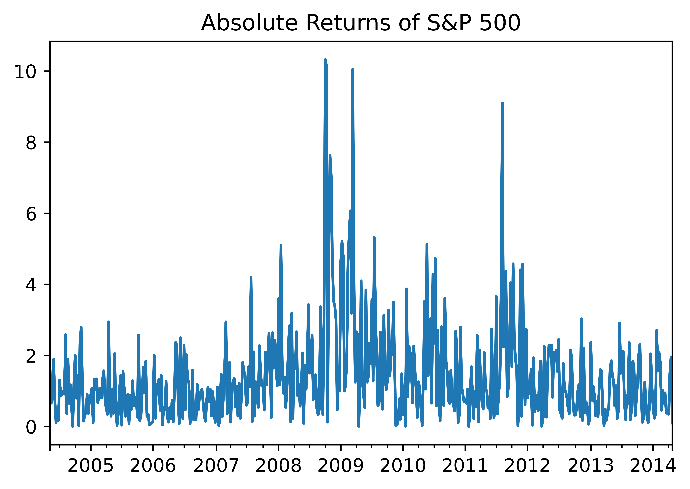
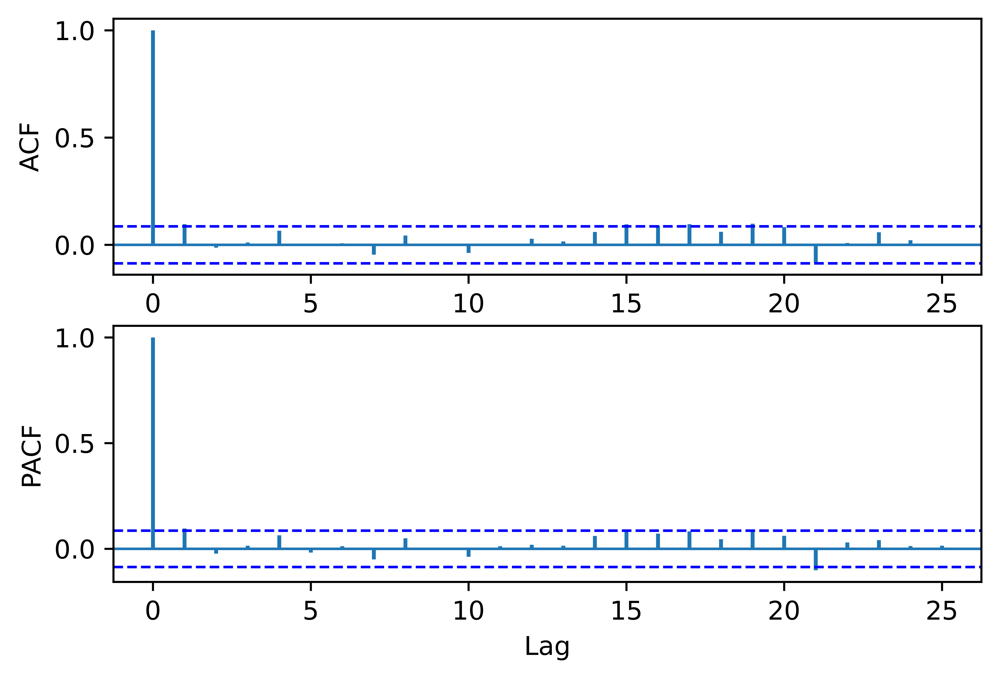
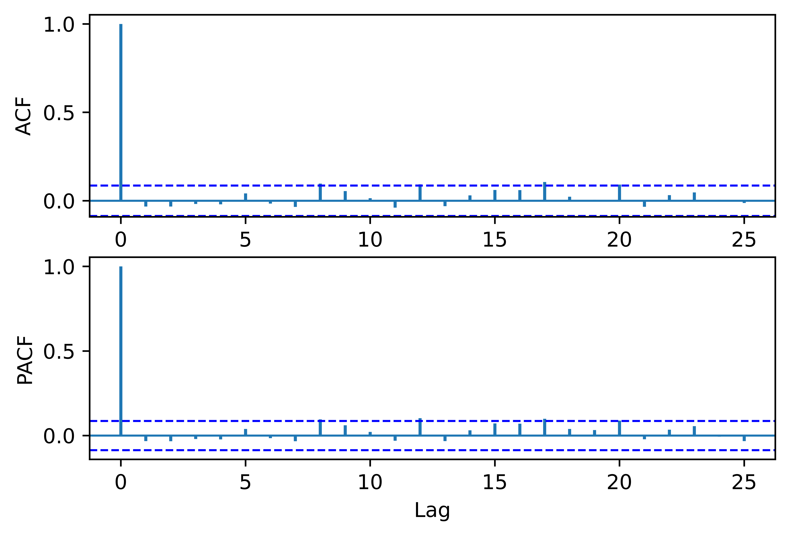

[](http://quantlet.de/)

## [](http://quantlet.de/) **pyTSA_MarkovReturnsSP500** [](http://quantlet.de/)

```yaml


Name of Quantlet:    'pyTSA_MarkovReturnsSP500'

Published in:        'Applied Time Series Analysis and Forecasting with Python'

Description:         'This Quantlet plots monthly time series of returns of Procter and Gamble from 1961 to 2016 and  their ACF and PACF (Example, 2.4 Figures 2.8-2.9 in the book)'

Keywords:            'time series, autocorrelation, returns, ACF, PACF, plot, visualisation'

Author:              Huang Changquan, Alla Petukhina

Datafile:            monthly returns of Procter n Gamble stock n 3 market indexes 1961 to 2016.csv


```









### PYTHON Code
```python

import numpy as np
import pandas as pd
import statsmodels.api as sm
import matplotlib.pyplot as plt
from PythonTsa.plot_acf_pacf import acf_pacf_fig
from PythonTsa.LjungBoxtest import plot_LB_pvalue
from statsmodels.tsa.regime_switching.tests.test_markov_regression import areturns
index = pd.date_range("2004-05-04", "2014-5-03", freq = "W")
dta_areturns  =  pd.Series(areturns, index = index)
dta_areturns.plot(title = "Absolute Returns of S&P 500")
plt.savefig('pyTSA_MarkovReturnsSP500_fig8-18.png', dpi = 1200, bbox_inches ='tight', 
            transparent = True, legend = None); plt.show() 
myMauto1 =  sm.tsa.MarkovAutoregression(dta_areturns, k_regimes = 2, order = 4, switching_variance = True)
myfit1 = myMauto1.fit()
print(myfit1.summary())
myresid1 = myfit1.resid
acf_pacf_fig(myresid1, both = True, lag = 25)
plt.savefig('pyTSA_MarkovReturnsSP500_fig8-19.png', dpi = 1200, bbox_inches ='tight', 
            transparent = True, legend = None); plt.show() 
plot_LB_pvalue(myresid1, noestimatedcoef = 0, nolags = 25)
plt.savefig('pyTSA_MarkovReturnsSP500_fig8-20.png', dpi = 1200, bbox_inches ='tight', 
            transparent = True, legend = None); plt.show() 
Ldta = np.log(dta_areturns)
myMauto =  sm.tsa.MarkovAutoregression(Ldta,
k_regimes = 2, order = 4, trend = 'n', switching_variance = True)
myfit = myMauto.fit()
print(myfit.summary())
myresid = myfit.resid
acf_pacf_fig(myresid, both = True, lag = 25)
plt.savefig('pyTSA_MarkovReturnsSP500_fig8-21.png', dpi = 1200, bbox_inches ='tight', 
            transparent = True, legend = None); plt.show() 
plot_LB_pvalue(myresid, noestimatedcoef = 0, nolags = 25)
plt.savefig('pyTSA_MarkovReturnsSP500_fig8-22.png', dpi = 1200, bbox_inches ='tight', 
            transparent = True, legend = None); plt.show() 
```

automatically created on 2022-02-28