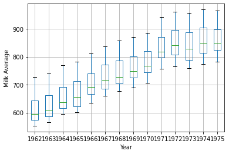
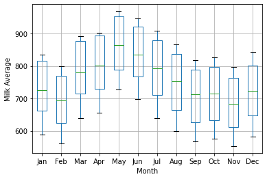

[](http://quantlet.de/)

## [](http://quantlet.de/) **pyTSA_ MilkAv** [](http://quantlet.de/)

```yaml


Name of Quantlet:    'pyTSA_ MilkAv'

Published in:        'Applied Time Series Analysis and Forecasting with Python'

Description:         'This Quantlet builds time series of monthly recorded milk average per cow at a dairy cattle ranch in China from Jan.1962 to Dec.1975. It produces yearly and monthly box plots of this dataset'

Keywords:            'box plot , time series, plot, seasonality'

Author:              Huang Changquan, Alla Petukhina

Dataset:             milk.xlsx


```



