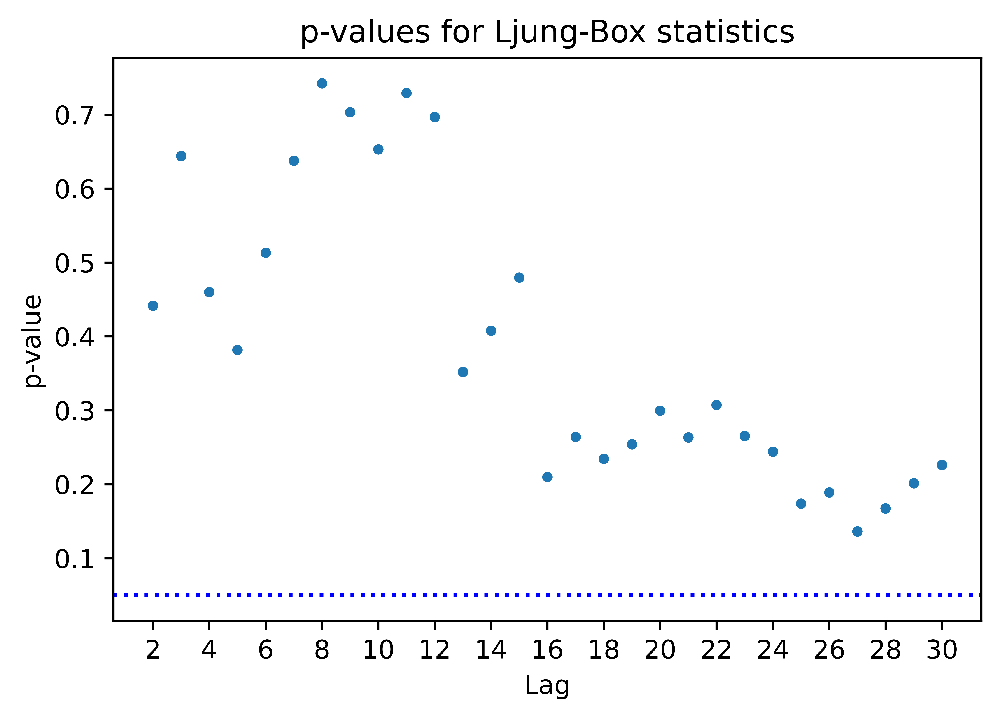

[](http://quantlet.de/)

## [](http://quantlet.de/) **pyTSA_NaoARMA** [](http://quantlet.de/)

```yaml


Name of Quantlet:    'pyTSA_NaoARMA'

Published in:        'Applied Time Series Analysis and Forecasting with Python'

Description:         'This Quantlet plots  the monthly mean of North Atlantic Oscillation (NAO) index since January 1950 till December 2019, ots ACF and PACF, further fits ARMA model and performs Ljung-Box statistics'

Keywords:            'time series,  stationarity, autocorrelation, PACF, ACF, ARMA, moving average, autoregression,  Ljung-Box'

Author[New]:         Huang Changquan, Alla Petukhina


```





### PYTHON Code
```python

import pandas as pd
import matplotlib.pyplot as plt
import statsmodels.api as sm
from PythonTsa.plot_acf_pacf import acf_pacf_fig
from statsmodels.tsa.arima_model import ARMA
from PythonTsa.LjungBoxtest import plot_LB_pvalue
nao = pd.read_csv('nao.csv', header = 0) # Define the path to the dataset
timeindex = pd.date_range('1950-01', periods = len(nao),freq = 'M')
nao.index = timeindex
naots = nao['index']# automatically become a Series, see below
type(nao)
type(naots)
naots.plot()
plt.show()
acf_pacf_fig(naots, both = True, lag = 48)
sm.tsa.stattools.kpss(naots, regression = "c", lags = 50)
ar1 = ARMA(naots, order = (1,0)).fit(trend = 'c')
print(ar1.summary())
resid1 = ar1.resid
acf_pacf_fig(resid1, both = True, lag = 48)
plot_LB_pvalue(resid1, noestimatedcoef = 1, nolags = 30) 
	# noestimatedcoef = number of estimated coefficients
	# nolags = max number of added terms in LB statistic
ar1.plot_predict(start = '2010-04', end = '2019-12')
ma1 = ARMA(naots, order = (0,1)).fit(trend = 'nc')
ma1.aic; ma1.bic; ma1.hqic
```

automatically created on 2022-02-09