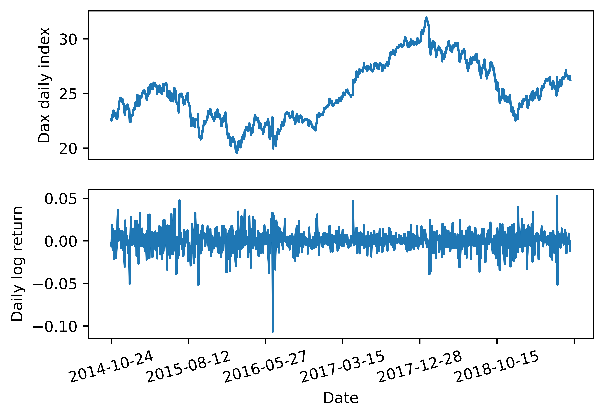

[](http://quantlet.de/)

## [](http://quantlet.de/) **pyTSA_ReturnsDAX** [](http://quantlet.de/)

```yaml


Name of Quantlet:    'pyTSA_ReturnsDAX'

Published in:        'Applied Time Series Analysis and Forecasting with Python'

Description:         'This Quantlet plots monthly time series of returns of Procter and Gamble from 1961 to 2016 and  their ACF and PACF (Example, 2.4 Figures 2.8-2.9 in the book)'

Keywords:            'time series, autocorrelation, returns, ACF, PACF, plot, visualisation'

Author:              Huang Changquan, Alla Petukhina

Datafile:            monthly returns of Procter n Gamble stock n 3 market indexes 1961 to 2016.csv


```




### PYTHON Code
```python

import pandas as pd
import numpy as np
import matplotlib.pyplot as plt
from PythonTsa.LjungBoxtest import plot_LB_pvalue
dax = pd.read_csv('DAX.csv', header = 0)
dax.rename(columns = {'Adj Close' : 'index'}, inplace = True)
dax['logreturns'] = np.log(dax['index']/dax['index'].shift(1))
dax  =  dax.dropna()
logret  =  dax['logreturns']
logret.index  =  dax['Date']
fig  =  plt.figure()
dax['index'].plot(ax =  fig.add_subplot(211))
plt.ylabel('Dax daily index')
plt.xticks([])
logret.plot(ax =  fig.add_subplot(212))
plt.ylabel('Daily log return')
plt.xticks(rotation = 15)
plt.savefig('pyTSA_ReturnsDAX_fig6-5.png', dpi = 1200, 
             bbox_inches ='tight', transparent = True, legend = None); plt.show()
plot_LB_pvalue(logret, noestimatedcoef = 0, nolags = 48)
plt.savefig('pyTSA_ReturnsDAX_fig6-6.png', dpi = 1200, 
             bbox_inches ='tight', transparent = True, legend = None)
```

automatically created on 2022-02-28