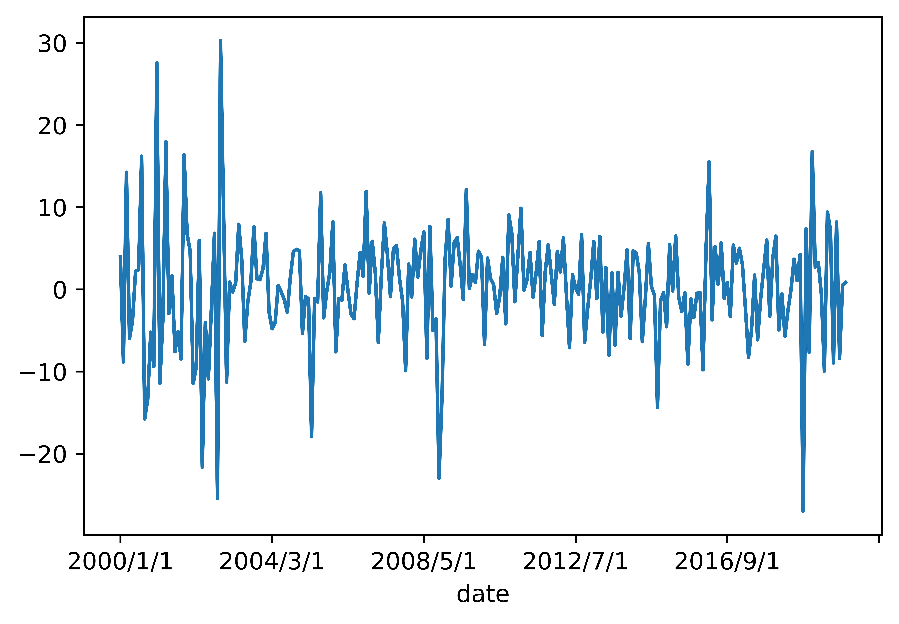
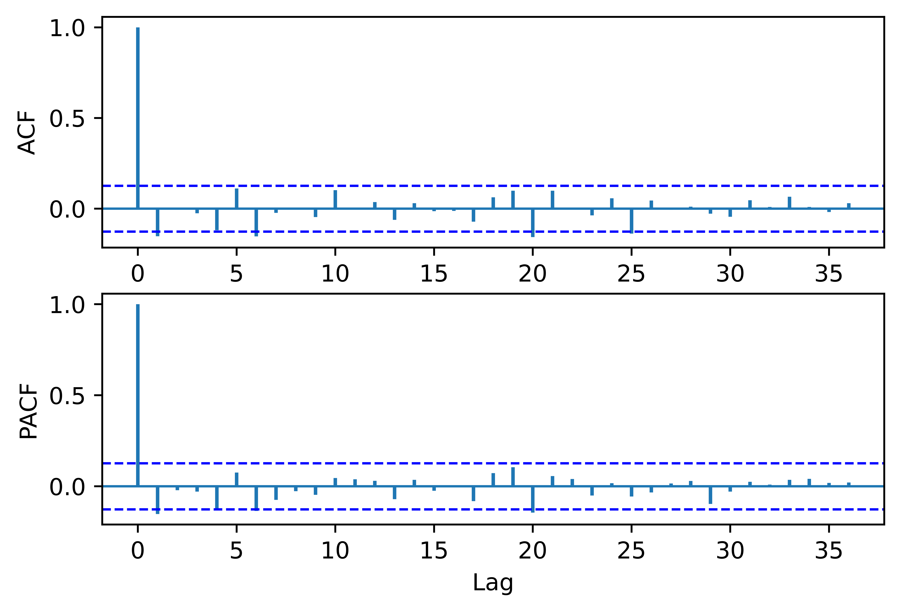
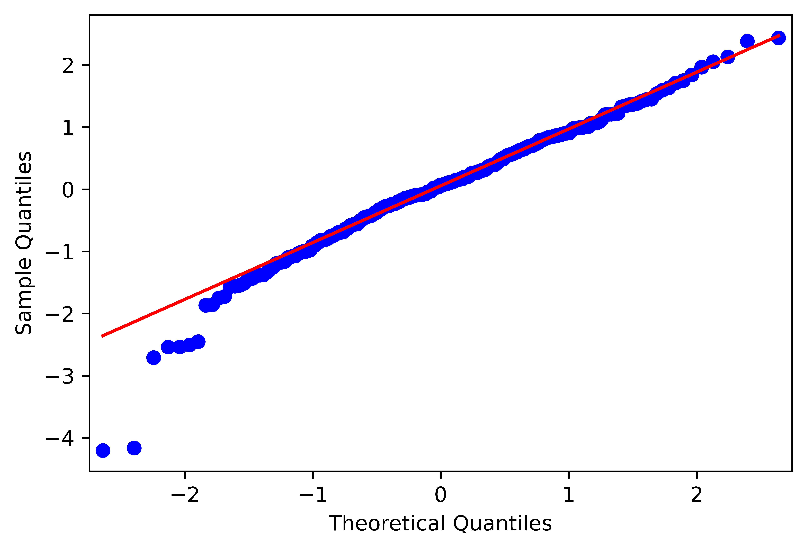

[](http://quantlet.de/)

## [](http://quantlet.de/) **pyTSA_ReturnsIBM** [](http://quantlet.de/)

```yaml


Name of Quantlet:    'pyTSA_ReturnsIBM'

Published in:        'Applied Time Series Analysis and Forecasting with Python'

Description:         'This Quantlet plots monthly time series of returns of Procter and Gamble from 1961 to 2016 and  their ACF and PACF (Example, 2.4 Figures 2.8-2.9 in the book)'

Keywords:            'time series, autocorrelation, returns, ACF, PACF, plot, visualisation'

Author:              Huang Changquan, Alla Petukhina

Datafile:            monthly returns of Procter n Gamble stock n 3 market indexes 1961 to 2016.csv


```








### PYTHON Code
```python

import pandas as pd
#import numpy as np
import matplotlib.pyplot as plt
import statsmodels.api as sm
from PythonTsa.plot_acf_pacf import acf_pacf_fig
from PythonTsa.LjungBoxtest import plot_LB_pvalue
from arch import arch_model
from PythonTsa.Selecting_arma import choose_arma
from statsmodels.graphics.api import qqplot
ibm = pd.read_csv('ibmlogret.csv', header = 0)
logret = ibm['logreturn']
logret.index = ibm['date']
logret.plot()
plt.savefig('pyTSA_ReturnsIBM_fig6-29.png', dpi = 1200, 
             bbox_inches ='tight', transparent = True, legend = None); plt.show()
sm.tsa.kpss(logret, regression = 'c', nlags = 'auto')
acf_pacf_fig(logret, both = True, lag = 36)
plt.savefig('pyTSA_ReturnsIBM_fig6-30.png', dpi = 1200, 
             bbox_inches ='tight', transparent = True, legend = None); plt.show()
plot_LB_pvalue(logret, noestimatedcoef = 0, nolags = 36)
plt.savefig('pyTSA_ReturnsIBM_fig6-31.png', dpi = 1200, 
             bbox_inches ='tight', transparent = True, legend = None)
choose_arma(logret, max_p = 2, max_q = 2, ctrl = 1.01)
arma = sm.tsa.ARMA(logret, order = (0, 1)).fit(trend = 'nc')
print(arma.summary())
armaresid = arma.resid
plot_LB_pvalue(armaresid, noestimatedcoef = 1, nolags = 36)
plt.savefig('pyTSA_ReturnsIBM_fig6-32.png', dpi = 1200, 
             bbox_inches ='tight', transparent = True, legend = None) 
plot_LB_pvalue(armaresid**2, noestimatedcoef = 0, nolags = 36)
plt.savefig('pyTSA_ReturnsIBM_fig6-33.png', dpi = 1200, 
             bbox_inches ='tight', transparent = True, legend = None) 
garch = arch_model(armaresid, p = 1, q = 1, mean = 'Zero').fit(disp = 'off')
print(garch.summary())
egarch = arch_model(armaresid, p = 0, o = 1, q = 1, mean = 'Zero', 
                    vol = 'EGARCH').fit(disp = 'off')
print(egarch.summary())
egarchresid = egarch.std_resid
plot_LB_pvalue(egarchresid, noestimatedcoef = 0, nolags = 36)
plt.savefig('pyTSA_ReturnsIBM_fig6-34.png', dpi = 1200, 
             bbox_inches ='tight', transparent = True, legend = None) 
plot_LB_pvalue(egarchresid**2, noestimatedcoef = 0, nolags = 36)
plt.savefig('pyTSA_ReturnsIBM_fig6-35.png', dpi = 1200, 
             bbox_inches ='tight', transparent = True, legend = None) 
qqplot(egarchresid, line = 'q', fit = True)
plt.savefig('pyTSA_ReturnsIBM_fig6-36.png', dpi = 1200, 
             bbox_inches ='tight', transparent = True, legend = None) 
```

automatically created on 2022-02-28