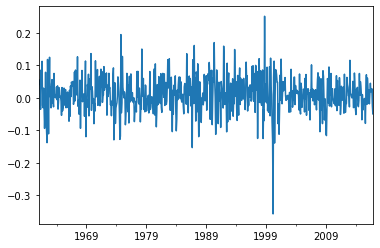
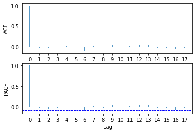

[](http://quantlet.de/)

## [](http://quantlet.de/) **pyTSA_ReturnsPG** [](http://quantlet.de/)

```yaml


Name of Quantlet:    'pyTSA_ReturnsPG'

Published in:        'Applied Time Series Analysis and Forecasting with Python'

Description:         'This Quantlet plots monthly time series of returns of Procter and Gamble from 1961 to 2016 and  their ACF and PACF (Example, 2.4 Figures 2.8-2.9 in the book)'

Keywords:            'time series, autocorrelation, returns, ACF, PACF, plot, visualisation'

Author:              Huang Changquan, Alla Petukhina

Datafile:            monthly returns of Procter n Gamble stock n 3 market indexes 1961 to 2016.csv


```





### PYTHON Code
```python

import pandas as pd
import matplotlib.pyplot as plt
from PythonTsa.plot_acf_pacf import acf_pacf_fig
from statsmodels.tsa.stattools import acf
x = pd.read_table('monthly returns of Procter n Gamble stock n 3 market indexes 1961 to 2016.csv', 
                  sep = ',', header = 0)
timeindex = pd.date_range('1961', periods = len(x), freq = 'M')
x.index = timeindex
yts = x['RET']
yts.plot(); plt.show()
yts.describe()
pd.Series.idxmax(yts) # get the position of the maximum
#Timestamp('1998-10-31 00:00:00', freq = 'M')
pd.Series.idxmin(yts) # get the position of the minimum
#Timestamp('2000-03-31 00:00:00', freq = 'M')
acf_pacf_fig(yts, both = True, lag = 17)
r,q,p = acf(yts,qstat = True)
p
```

automatically created on 2022-01-20