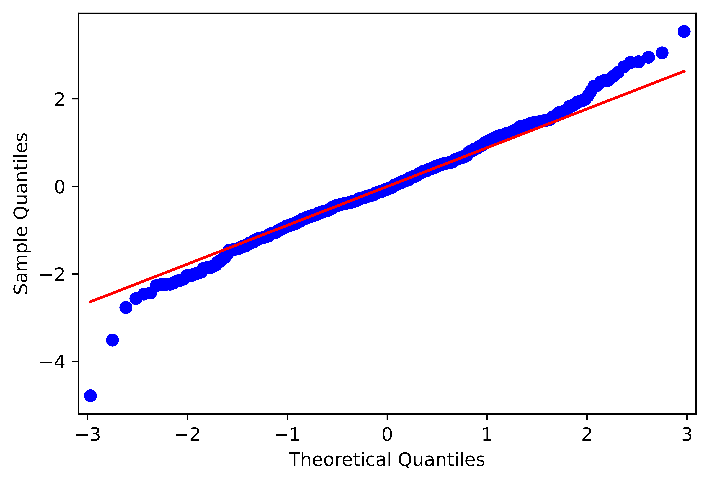
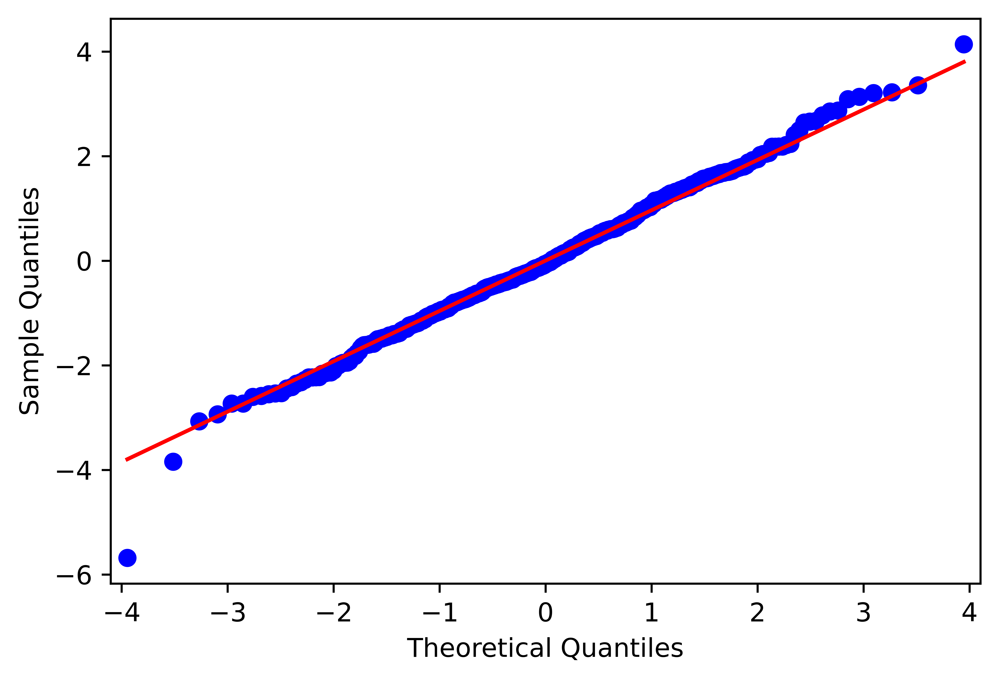
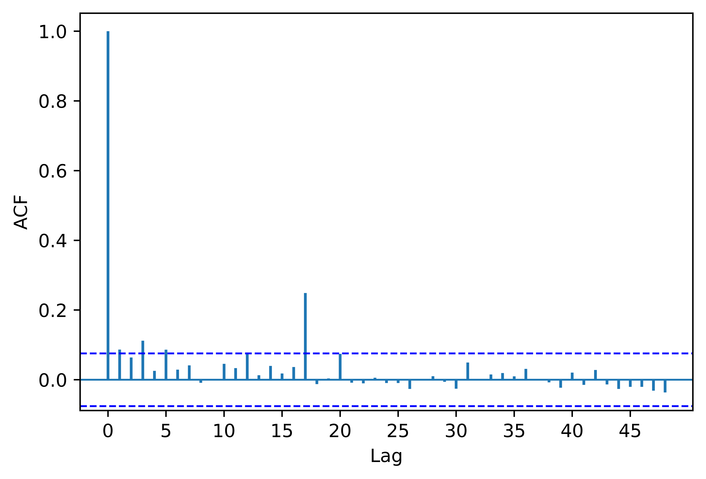
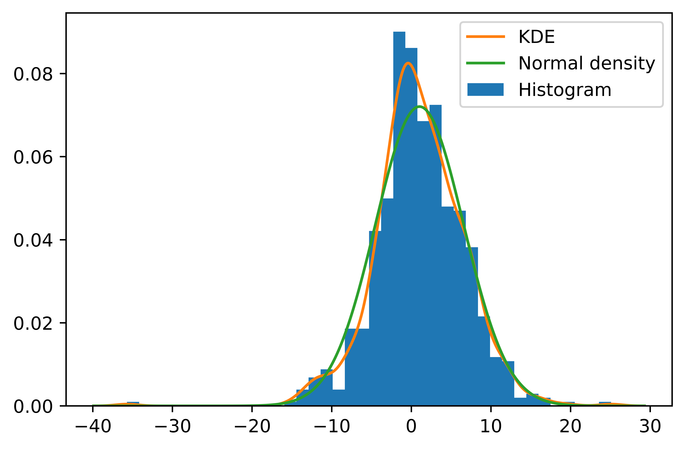

[](http://quantlet.de/)

## [](http://quantlet.de/) **pyTSA_ReturnsPG2** [](http://quantlet.de/)

```yaml


Name of Quantlet:    'pyTSA_ReturnsPG2'

Published in:        'Applied Time Series Analysis and Forecasting with Python'

Description:         'This Quantlet plots monthly time series of returns of Procter and Gamble from 1961 to 2016 and  their ACF and PACF (Example, 2.4 Figures 2.8-2.9 in the book)'

Keywords:            'time series, autocorrelation, returns, ACF, PACF, plot, visualisation'

Author:              Huang Changquan, Alla Petukhina

Datafile:            monthly returns of Procter n Gamble stock n 3 market indexes 1961 to 2016.csv


```












### PYTHON Code
```python

import pandas as pd
import numpy as np
import matplotlib.pyplot as plt
from PythonTsa.plot_acf_pacf import acf_pacf_fig
import statsmodels.api as sm
from PythonTsa.LjungBoxtest import plot_LB_pvalue
from scipy.stats import norm
from arch import arch_model
from statsmodels.graphics.api import qqplot
from scipy import stats
pgret = pd.read_csv('monthly returns of Procter n Gamble stock n 3 market indexes 1961 to 2016.csv', 
                    header = 0)
pgret = pgret['RET']
dates = pd.date_range('1961-01', periods = len(pgret), freq = 'M')
pgret.index = dates
pgret = 100*pgret # many pgret values are too small, which may affect convergence
                  # of the optimizer when estimating the parameters, so rescale it.
sm.tsa.kpss(pgret, regression = 'c', nlags = 'auto')
plot_LB_pvalue(pgret, noestimatedcoef = 0, nolags = 36)
plt.savefig('pyTSA_ReturnsPG2_fig6-1.png', dpi = 1200, 
             bbox_inches ='tight', transparent = True, legend = None)
acf_pacf_fig(pgret**2, lag = 48)
plt.savefig('pyTSA_ReturnsPG2_fig6-2.png', dpi = 1200, 
             bbox_inches ='tight', transparent = True, legend = None)
plot_LB_pvalue(pgret**2, noestimatedcoef = 0, nolags = 36)
plt.savefig('pyTSA_ReturnsPG2_fig6-3.png', dpi = 1200, 
             bbox_inches ='tight', transparent = True, legend = None)
fig = plt.figure()
ax = fig.add_subplot(111)
hfig = ax.hist(pgret, bins = 40, density = True, label = 'Histogram')
kde = sm.nonparametric.KDEUnivariate(pgret)
kde.fit()
ax.plot(kde.support, kde.density, label = 'KDE')
smean = np.mean(pgret)
scal = np.std(pgret, ddof = 1)
normden = norm.pdf(kde.support, loc = smean, scale = scal)
ax.plot(kde.support, normden, label = 'Normal density')
ax.legend(loc = 'best')
plt.savefig('pyTSA_ReturnsPG2_fig6-4.png', dpi = 1200, 
             bbox_inches ='tight', transparent = True, legend = None); plt.show()

archmod = arch_model(pgret).fit()
print(archmod.summary())
archresid = archmod.std_resid
plot_LB_pvalue(archresid, noestimatedcoef = 0, nolags = 36)
plt.savefig('pyTSA_ReturnsPG2_fig6-12.png', dpi = 1200, 
             bbox_inches ='tight', transparent = True, legend = None)
plot_LB_pvalue(archresid**2, noestimatedcoef = 0, nolags = 36)
plt.savefig('pyTSA_ReturnsPG2_fig6-13.png', dpi = 1200, 
             bbox_inches ='tight', transparent = True, legend = None)
qqplot(archresid, line = 'q', fit = True)
plt.savefig('pyTSA_ReturnsPG2_fig6-14.png', dpi = 1200, 
             bbox_inches ='tight', transparent = True, legend = None); plt.show()
garchT = arch_model(pgret, p = 1, q = 1, dist = 'StudentsT')
res = garchT.fit()
print(res.summary()) # nu denotes degree of freedom for the T distribution
archresidT = res.std_resid
plot_LB_pvalue(archresidT, noestimatedcoef = 0, nolags = 36)
plt.savefig('pyTSA_ReturnsPG2_fig6-15.png', dpi = 1200, 
             bbox_inches ='tight', transparent = True, legend = None)
plot_LB_pvalue(archresidT**2, noestimatedcoef = 0, nolags = 36)
plt.savefig('pyTSA_ReturnsPG2_fig6-16.png', dpi = 1200, 
             bbox_inches ='tight', transparent = True, legend = None)
qqplot(archresidT, stats.t, distargs = (9.62, ), line = 'q', fit = True)
# arguments "stats.t" and "distargs" means T distribution and its
# degree of freedom.
plt.savefig('pyTSA_ReturnsPG2_fig6-17.png', dpi = 1200, 
             bbox_inches ='tight', transparent = True, legend = None); plt.show()


```

automatically created on 2022-02-28