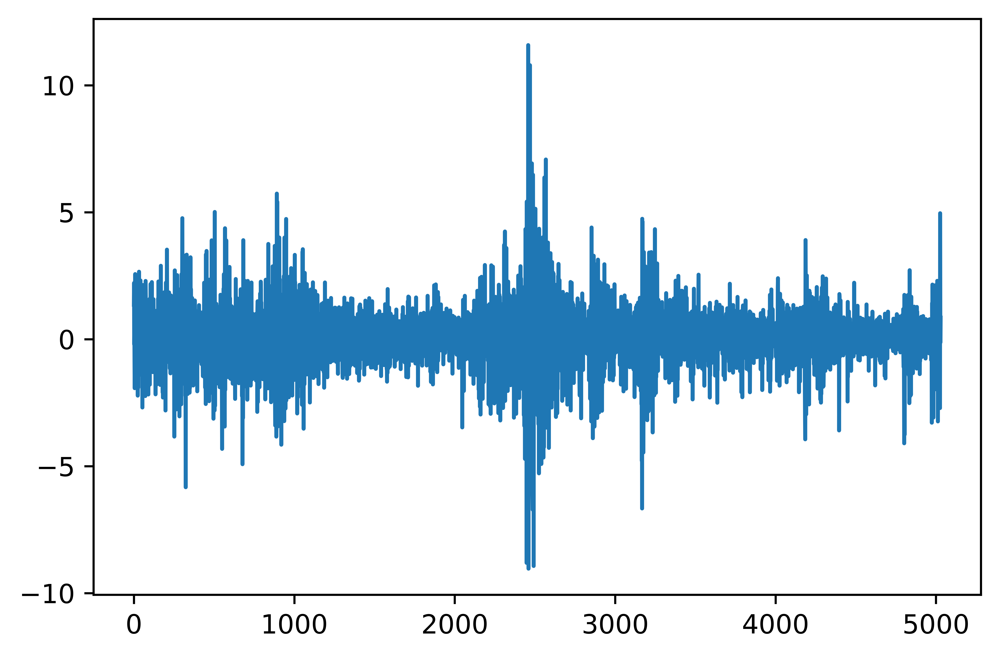
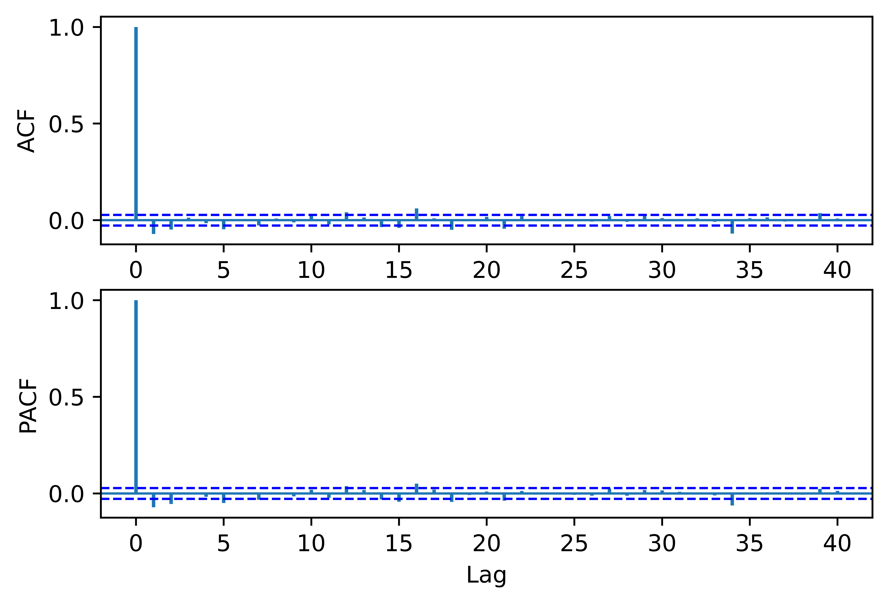
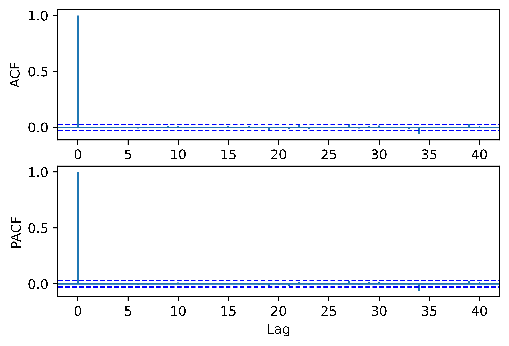
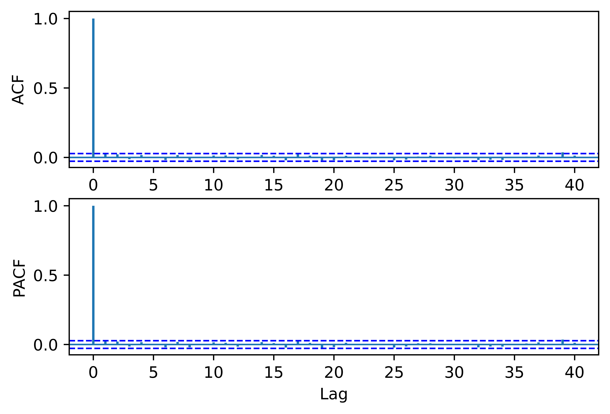
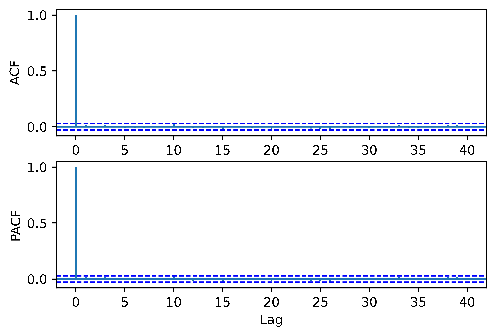

[](http://quantlet.de/)

## [](http://quantlet.de/) **pyTSA_ReturnsSP500** [](http://quantlet.de/)

```yaml


Name of Quantlet:    'pyTSA_ReturnsSP500'

Published in:        'Applied Time Series Analysis and Forecasting with Python'

Description:         'This Quantlet plots monthly time series of returns of Procter and Gamble from 1961 to 2016 and  their ACF and PACF (Example, 2.4 Figures 2.8-2.9 in the book)'

Keywords:            'time series, autocorrelation, returns, ACF, PACF, plot, visualisation'

Author:              Huang Changquan, Alla Petukhina

Datafile:            monthly returns of Procter n Gamble stock n 3 market indexes 1961 to 2016.csv


```















### PYTHON Code
```python

import pandas as pd
import matplotlib.pyplot as plt
import statsmodels.api as sm
from PythonTsa.plot_acf_pacf import acf_pacf_fig
from PythonTsa.LjungBoxtest import plot_LB_pvalue
from arch import arch_model
from statsmodels.graphics.api import qqplot
ret = pd.read_csv('SP500dailyreturns.csv', header = None)
ret.columns = ['returns']
ret = pd.Series(ret['returns'])
ret.plot()
plt.savefig('pyTSA_ReturnsSP500_fig6-18.png', dpi = 1200, 
             bbox_inches ='tight', transparent = True, legend = None); plt.show()
acf_pacf_fig(ret, both = True, lag = 40)
plt.savefig('pyTSA_ReturnsSP500_fig6-19.png', dpi = 1200, 
             bbox_inches ='tight', transparent = True, legend = None) 
sm.tsa.kpss(ret, regression = 'c', lags = 'auto')
plot_LB_pvalue(ret, noestimatedcoef = 0, nolags = 30)
plt.savefig('pyTSA_ReturnsSP500_fig6-20.png', dpi = 1200, 
             bbox_inches ='tight', transparent = True, legend = None) 
arma152 = sm.tsa.SARIMAX(ret, order = (15, 0, 2), trend = 'c').fit()
print(arma152.summary())
arma122 = sm.tsa.SARIMAX(ret, order = ([1, 1, 1, 1, 1, 1, 1, 0, 1, 0, 1, 1, 1, 0, 1], 0, 2), 
                         trend = 'n').fit()
print(arma122.summary())
xresid = arma122.resid
acf_pacf_fig(xresid, both = True, lag = 40)
plt.savefig('pyTSA_ReturnsSP500_fig6-21.png', dpi = 1200, 
             bbox_inches ='tight', transparent = True, legend = None) 
plot_LB_pvalue(xresid, noestimatedcoef = 14, nolags = 30)
plt.savefig('pyTSA_ReturnsSP500_fig6-22.png', dpi = 1200, 
             bbox_inches ='tight', transparent = True, legend = None) 
acf_pacf_fig(xresid**2, lag = 40)
plt.savefig('pyTSA_ReturnsSP500_fig6-23.png', dpi = 1200, 
             bbox_inches ='tight', transparent = True, legend = None) 
garch = arch_model(xresid, p = 2, q = 2, mean = 'Zero')
garchmod = garch.fit(disp = 'off')
print(garchmod.summary())
garchresid = garchmod.std_resid
acf_pacf_fig(garchresid, both = True, lag = 40)
plt.savefig('pyTSA_ReturnsSP500_fig6-24.png', dpi = 1200, 
             bbox_inches ='tight', transparent = True, legend = None) 
plot_LB_pvalue(garchresid, noestimatedcoef = 0, nolags = 30)
plt.savefig('pyTSA_ReturnsSP500_fig6-25.png', dpi = 1200, 
             bbox_inches ='tight', transparent = True, legend = None) 
acf_pacf_fig(garchresid**2, both = True, lag = 40)
plt.savefig('pyTSA_ReturnsSP500_fig6-26.png', dpi = 1200, 
             bbox_inches ='tight', transparent = True, legend = None) 
plot_LB_pvalue(garchresid**2, noestimatedcoef = 0, nolags = 30)
plt.savefig('pyTSA_ReturnsSP500_fig6-27.png', dpi = 1200, 
             bbox_inches ='tight', transparent = True, legend = None) 
qqplot(garchresid, line = 'q', fit = True); plt.show()
plt.savefig('pyTSA_ReturnsSP500_fig6-28.png', dpi = 1200, 
             bbox_inches ='tight', transparent = True, legend = None); plt.show()
```

automatically created on 2022-02-28