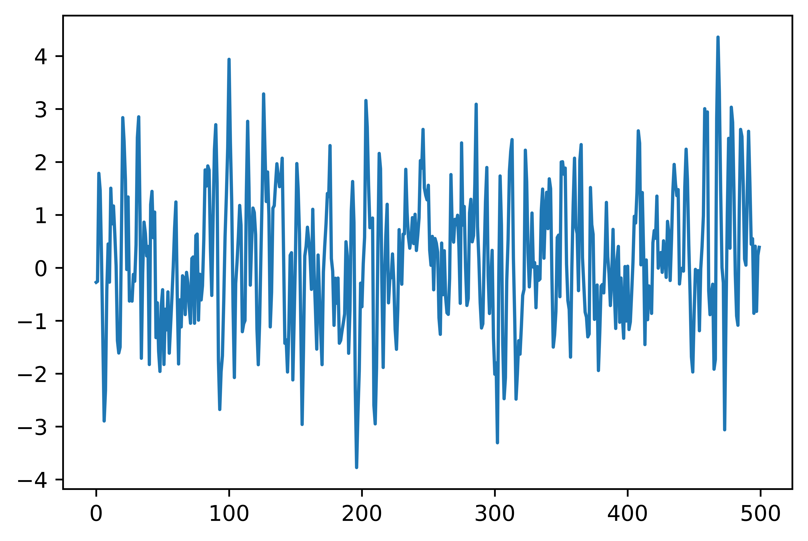
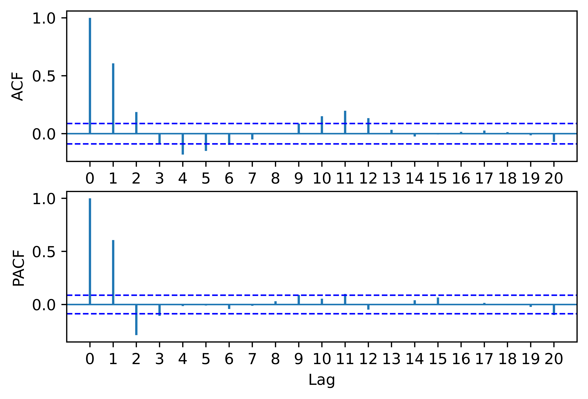
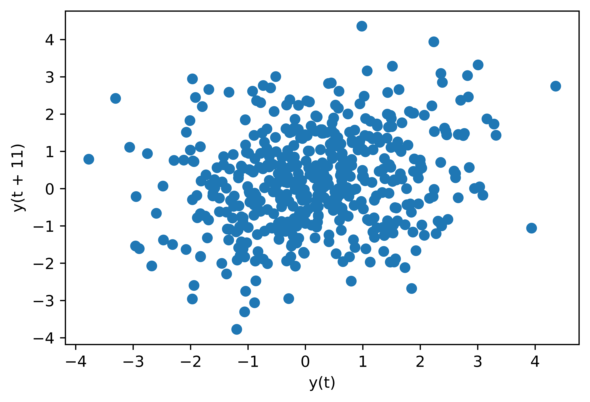

[](http://quantlet.de/)

## [](http://quantlet.de/) **pyTSA_SimAR2** [](http://quantlet.de/)

```yaml


Name of Quantlet:    'pyTSA_SimAR2'

Published in:        'Applied Time Series Analysis and Forecasting with Python'

Description:         'This Quantlet simulates and plots AR(2) time series and its ACF and PACF.'

Keywords:            'time series,  stationarity, autocorrelation, PACF, ACF, simulation, stochastic process, ARMA'

Author[New]:         Huang Changquan, Alla Petukhina


```







### PYTHON Code
```python

import numpy as np
import pandas as pd
import matplotlib.pyplot as plt
from statsmodels.tsa.arima_process import arma_generate_sample
from PythonTsa.plot_acf_pacf import acf_pacf_fig
from pandas.plotting import lag_plot
ar = np.array([1, -0.8, 0.3])
np.random.seed(123457)
x =  arma_generate_sample(ar = ar, ma = [1], nsample = 500) # ma = [1] means no ma part in the model
x = pd.Series(x)
x.plot(); plt.savefig('TSP_AR2_fig3-14.png')
acf_pacf_fig(x, both = True, lag = 20)
lag_plot(x, lag = 11); plt.savefig('TSP_AR2_fig3-16.png')
```

automatically created on 2022-01-20
