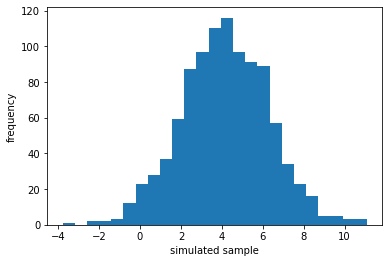
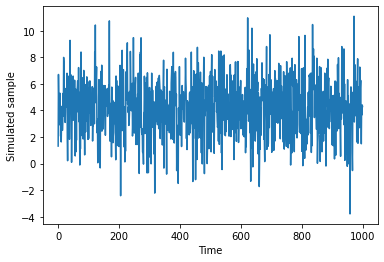

[](http://quantlet.de/)

## [](http://quantlet.de/) **pyTSA_SimGauss** [](http://quantlet.de/)

```yaml


Name of Quantlet:    'pyTSA_SimGauss'

Published in:        'Applied Time Series Analysis and Forecasting with Python'

Description:         'This Quantlet draws 1000 random numbers  from the normal  distribution, produces histogram and time series plot'

Keywords:            'random, distribution, Gaussian, normal'

Author:              Huang Changquan, Alla Petukhina


```





### PYTHON Code
```python

import numpy as np
import pandas as pd
import matplotlib.pyplot as plt
np.random.seed(135)
x = np.random.normal(loc=4.1, scale=2.2, size = 1000)
type(x)
h_fig = plt.hist(x, bins=25)
plt.xlabel('simulated sample'); plt.ylabel('frequency')
plt.show()
xts = pd.Series(x)
type(xts)
xts.plot(); plt.xlabel('Time'); plt.ylabel('Simulated sample')
plt.show()
xts = pd.Series(x)
type(xts)
xts.plot(); plt.xlabel('Time'); plt.ylabel('Simulated sample')
plt.show()
```

automatically created on 2022-01-20