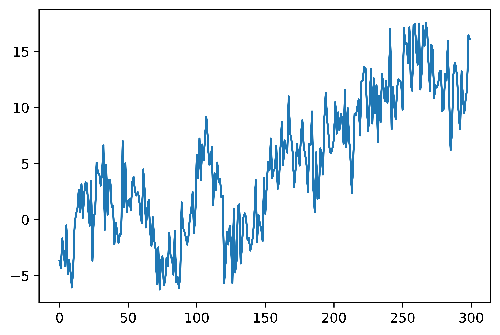
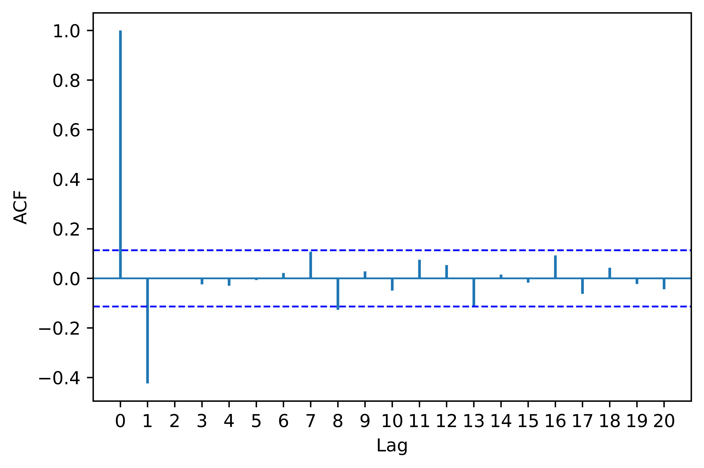

[](http://quantlet.de/)

## [](http://quantlet.de/) **pyTSA_SimLLM** [](http://quantlet.de/)

```yaml


Name of Quantlet:    'pyTSA_SimLLM'

Published in:        'Applied Time Series Analysis and Forecasting with Python'

Description:         'This Quantlet plots monthly time series of returns of Procter and Gamble from 1961 to 2016 and  their ACF and PACF (Example, 2.4 Figures 2.8-2.9 in the book)'

Keywords:            'time series, autocorrelation, returns, ACF, PACF, plot, visualisation'

Author:              Huang Changquan, Alla Petukhina

Datafile:            monthly returns of Procter n Gamble stock n 3 market indexes 1961 to 2016.csv


```






### PYTHON Code
```python

import numpy as np
import matplotlib.pyplot as plt
from PythonTsa.RandomWalk import RandomWalk_with_drift
from PythonTsa.plot_acf_pacf import acf_pacf_fig
np.random.seed(1379)
rw0 = RandomWalk_with_drift(drift = 0.0, nsample = 300, burnin = 10)
wn = np.random.normal(loc = 0, scale = 2.0, size = 300)
y = rw0+wn
y.plot()
plt.savefig('pyTSA_SimLLM_fig8-1.png', dpi = 1200, bbox_inches ='tight', 
            transparent = True, legend = None); plt.show() 
dy = y.diff().dropna()
dy.plot()
plt.savefig('pyTSA_SimLLM_fig8-2.png', dpi = 1200, bbox_inches ='tight', 
            transparent = True, legend = None); plt.show() 
acf_pacf_fig(dy, both = False, lag = 20)
plt.savefig('pyTSA_SimLLM_fig8-3.png', dpi = 1200, bbox_inches ='tight', 
            transparent = True, legend = None); plt.show() 
```

automatically created on 2022-02-28