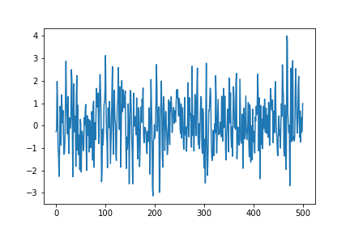
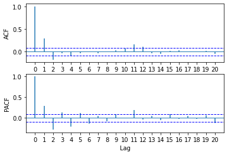
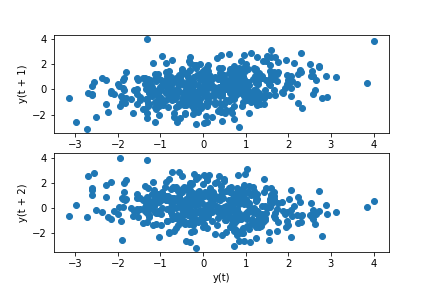
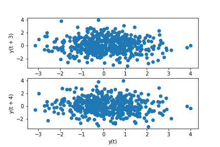

[](http://quantlet.de/)

## [](http://quantlet.de/) **pyTSA_MA2** [](http://quantlet.de/)

```yaml


Name of Quantlet:    'pyTSA_MA2'

Published in:        'Applied Time Series Analysis and Forecasting with Python'

Description:         'This Quantlet simulates and plots MA(2) -  moving average process time series, its ACF and PACF'

Keywords:            'time series,  stationarity, autocorrelation, PACF, ACF, simulation, stochastic process, ARMA, moving average, autoregression'

Author[New]:         Huang Changquan, Alla Petukhina


```







