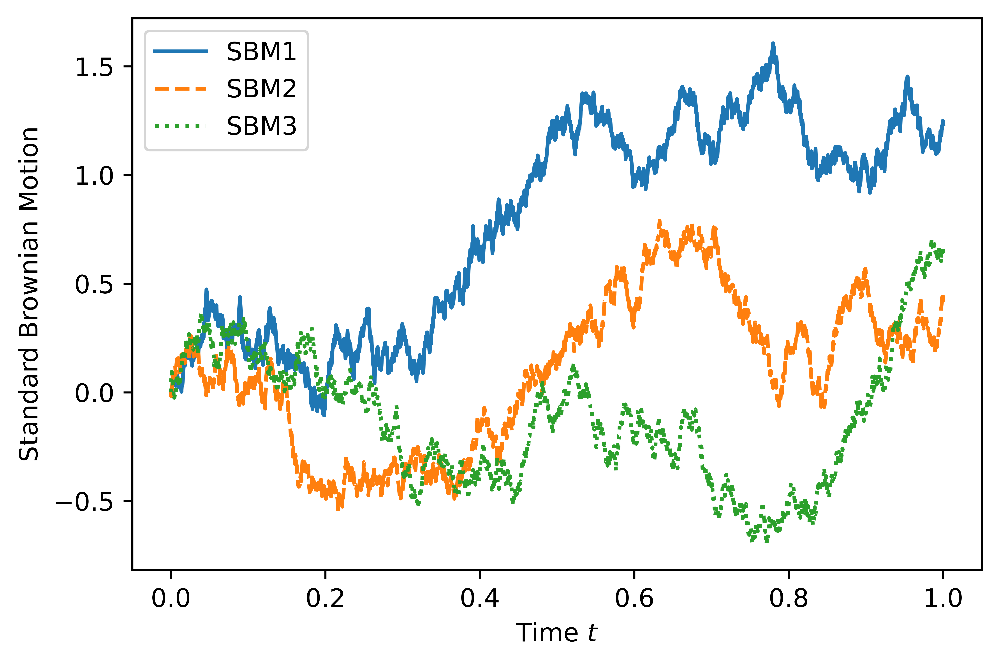

[](http://quantlet.de/)

## [](http://quantlet.de/) **pyTSA_SimSBM** [](http://quantlet.de/)

```yaml


Name of Quantlet:    'pyTSA_SimSBM'

Published in:        'Applied Time Series Analysis and Forecasting with Python'

Description:         'This Quantlet produces three simulated sample-paths of the standard Brownian motion using the function simulSBM(n, seed, fig)'

Keywords:            'brownian-motion, continuous, graphical representation, plot, process, simulation, standard, stochastic, stochastic-process, time-series, wiener-process'

Author:              Huang Changquan, Alla Petukhina


```


