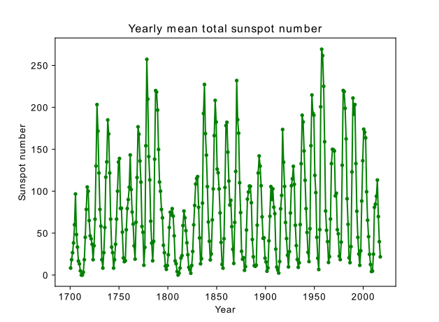

[](http://quantlet.de/)

## [](http://quantlet.de/) **pyTSA_Sunspot** [](http://quantlet.de/)

```yaml

Name of Quantlet:    'pyTSA_Sunspot'

Published in:        'Applied Time Series Analysis and Forecasting with Python'

Description:         'This Quantlet plots yearly mean total sunspot number for the period 1700 - 2017, obtained from Royal Observatory of Belgium, Brussels'

Keywords:            'time series, visualisation, plot'

Author:              Huang Changquan, Alla Petukhina

Datafile:            Yearly mean total sunspot number 1700 - 2017.csv


```



### PYTHON Code
```python

import pandas as pd
import matplotlib.pyplot as plt
x = pd.read_csv('Yearly mean total sunspot number 1700 - 2017.csv',  delimiter = ';', header = None) 
x.index = x[0];
sunspot = x.drop(columns=[0, 2, 3, 4])
sunspot.plot(legend = False, color="green"); plt.title('Yearly mean total sunspot number')
plt.ylabel('Sunspot number'); plt.xlabel('Year'); plt.show()
plt.savefig('Sunspot_number.png')
```

automatically created on 2022-06-09