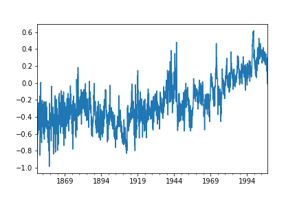
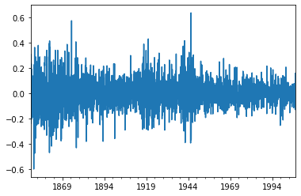
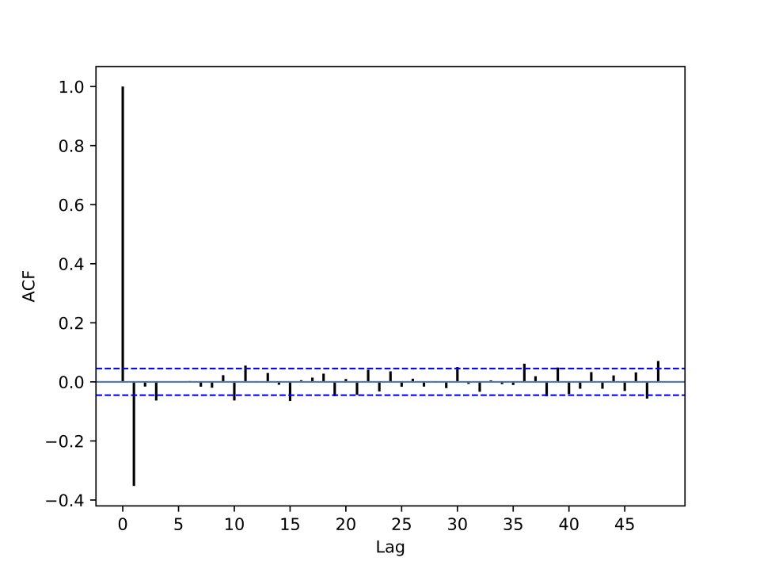

[](http://quantlet.de/)

## [](http://quantlet.de/) **pyTSA_TemperatureSH** [](http://quantlet.de/)

```yaml


Name of Quantlet:    'pyTSA_TemperatureSH'

Published in:        'Applied Time Series Analysis and Forecasting with Python'

Description:         'This Quantlet plots time series of monthly temperature volatility for the southern hemisphere, its first order difference and its ACF for the period from January 1850 to December 2007'

Keywords:            'simulation, random walk, Gaussian, normal'

Author:              Huang Changquan, Alla Petukhina

Datafile:            Southtemperature.txt


```







### PYTHON Code
```python

import pandas as pd
import matplotlib.pyplot as plt
from PythonTsa.plot_acf_pacf import acf_pacf_fig
from statsmodels.tsa.stattools import kpss
tem = pd.read_csv('Southtemperature.txt', header = None, sep = '\s+')
#read_table is deprecated, use read_csv instead.
temts = pd.concat([tem.loc[0], tem.loc[1]], ignore_index = 'true')
for i in range(2, 158):
    temts = pd.concat([temts, tem.loc[i]], ignore_index = 'true')
type(temts)
dates = pd.date_range('1850', periods = len(temts), freq = 'M')
temts.index = dates
temts.plot(); plt.show();
dt = temts.diff(1) # the first differencing
dt = dt.dropna()
dt.plot(); plt.show()#savefig('TSP_TemperatureSH_fig3-3.png')
acf_pacf_fig(dt, both = False, lag = 48)
kpss(dt, regression = 'c')

```

automatically created on 2022-01-20