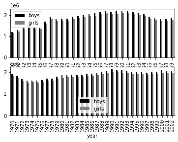
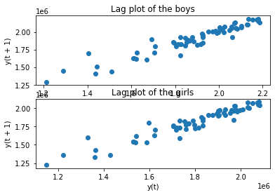

[](http://quantlet.de/)

## [](http://quantlet.de/) **pyTSA_USBoysGirls** [](http://quantlet.de/)

```yaml


Name of Quantlet:    'pyTSA_USBoysGirls'

Published in:        'Applied Time Series Analysis and Forecasting with Python'

Description:         'This Quantlet produces time series plot, the bar charts and lag plots to vizualize a data of
                      the numbers of boys and girls born in USA per year from 1940 to 2002.'

Keywords:            'time series, bar chart, vizualization, lag plot'

Author[New]:          Huang Changquan, Alla Petukhina


```





### PYTHON Code
```python

import pandas as pd
import matplotlib.pyplot as plt
from pandas.plotting import lag_plot
url= 'http://s3.amazonaws.com/assets.datacamp.com/course/dasi/present.txt'
birth= pd.read_table(url, sep=' ')
birth.to_csv('Noboyngirl.csv')
birth_year = birth.set_index('year') 
birth_year.plot(); plt.show()
boy,= plt.plot(birth_year['boys'],'b-', label='boys')
girl,= plt.plot(birth_year['girls'],'r--',label='girls')
plt.legend(handles=[boy, girl]); plt.show()
fig = plt.figure()
birth_year[:30].plot(kind='bar', color=['black','grey'], ax=fig.add_subplot(211))
birth_year[30:].plot(kind='bar', color=['black','grey'], ax=fig.add_subplot(212))
plt.show()
fig = plt.figure()
lag_plot(birth_year['boys'], ax=fig.add_subplot(211))
plt.title('Lag plot of the boys')
lag_plot(birth_year['girls'], ax=fig.add_subplot(212))
plt.title('Lag plot of the girls')
plt.show()

```

automatically created on 2022-02-09