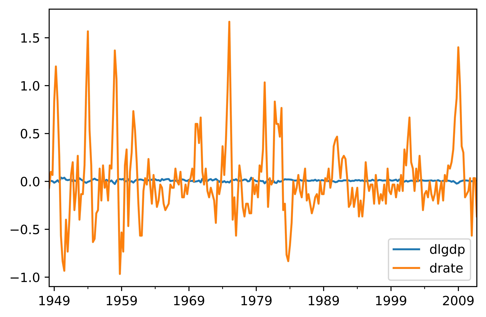

[](http://quantlet.de/)

## [](http://quantlet.de/) **pyTSA_USUnempGDP** [](http://quantlet.de/)

```yaml


Name of Quantlet:    'pyTSA_USUnempGDP'

Published in:        'Applied Time Series Analysis and Forecasting with Python'

Description:         'This Quantlet plots monthly time series of returns of Procter and Gamble from 1961 to 2016 and  their ACF and PACF (Example, 2.4 Figures 2.8-2.9 in the book)'

Keywords:            'time series, autocorrelation, returns, ACF, PACF, plot, visualisation'

Author:              Huang Changquan, Alla Petukhina

Datafile:            monthly returns of Procter n Gamble stock n 3 market indexes 1961 to 2016.csv


```





### PYTHON Code
```python

import numpy as np
import pandas as pd
import matplotlib.pyplot as plt
from PythonTsa.plot_multi_ACF import multi_ACFfig
from PythonTsa.plot_multi_Q_pvalue import MultiQpvalue_plot
mda = pd.read_csv( 'USQgdpunemp.csv', header = 0)
mda = mda[['gdp', 'rate']]
dates = pd.date_range('1948-01', periods = len(mda), freq = 'Q')
mda.index = dates
mda['gdp'] = np.log(mda['gdp'])
mda.columns = ['lgdp', 'rate']
multi_ACFfig(mda, nlags = 16); plt.gcf();
plt.savefig('pyTSA_USUnempGDP_fig7-4.png', dpi = 1200, 
             bbox_inches ='tight', transparent = True, legend = None)
dmda = mda.diff(1).dropna()
dmda.columns = ['dlgdp', 'drate']
dmda.plot()
plt.savefig('pyTSA_USUnempGDP_fig7-5.png', dpi = 1200, 
             bbox_inches ='tight', transparent = True, legend = None) ; plt.show()
multi_ACFfig(dmda, nlags = 16);  
plt.savefig('pyTSA_USUnempGDP_fig7-6.png', dpi = 1200, 
            bbox_inches ='tight', transparent = True, legend = None) 
qs, pv = MultiQpvalue_plot(dmda, nolags = 16); 
plt.savefig('pyTSA_USUnempGDP_fig7-7.png', dpi = 1200, bbox_inches ='tight', 
            transparent = True, legend = None)


```

automatically created on 2022-02-28