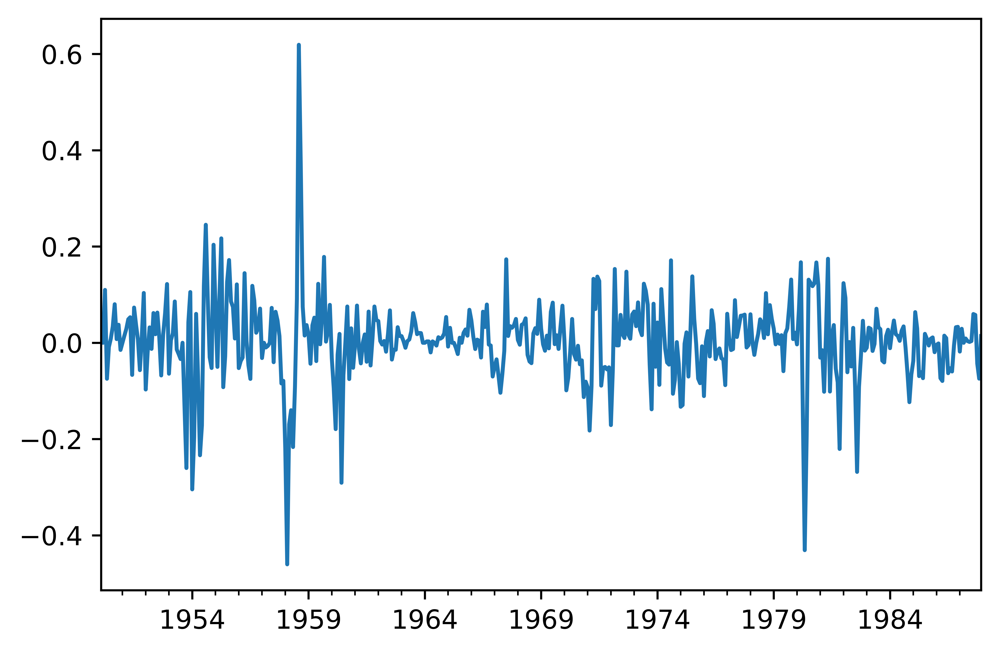
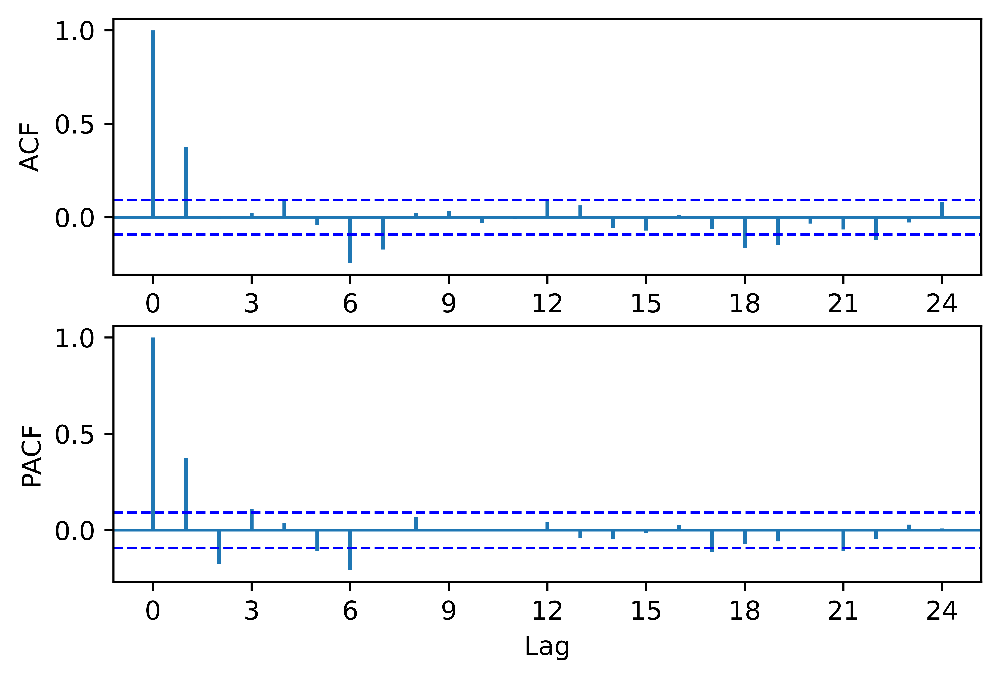
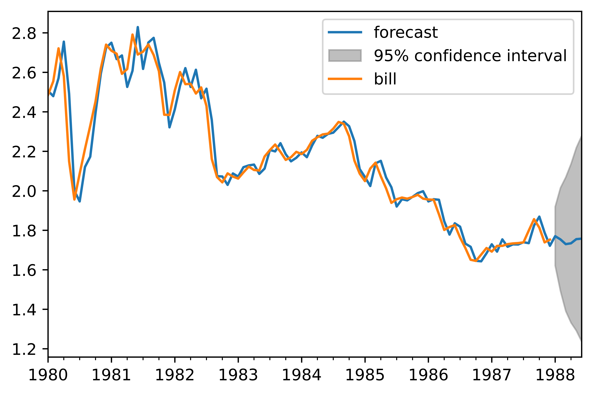

[](http://quantlet.de/)

## [](http://quantlet.de/) **pyTSA_USbill** [](http://quantlet.de/)

```yaml


Name of Quantlet:    'pyTSA_USbill'

Published in:        'Applied Time Series Analysis and Forecasting with Python'

Description:         'This Quantlet simulates ARMA(2,2) - autoregressive moving average process and draws the true ACF and PACF'

Keywords:            'time series,  stationarity, autocorrelation, PACF, ACF, simulation, stochastic process, ARMA, moving average, autoregression'

Author[New]:         Huang Changquan, Alla Petukhina


```









### PYTHON Code
```python

import numpy as np
import pandas as pd
import matplotlib.pyplot as plt
from PythonTsa.plot_acf_pacf import acf_pacf_fig
import statsmodels.api as sm
from PythonTsa.Selecting_arma import choose_arma
from statsmodels.tsa.arima_model import ARIMA
from PythonTsa.ModResidDiag import plot_ResidDiag
from scipy import stats
rat = pd.read_csv('USbill.csv',header = None)
rat.tail(6)
y = rat[:456]
# leave the last 6 items for forecast comparison
y.tail(6)
y.rename(columns = {0:'time', 1:'bill'},inplace = True)
# ARIMA requires 'strings' for column names.
dates = pd.date_range('1950-1',periods = len(y),freq = 'M')
y.index = dates
y = y['bill']
y.plot(); plt.show()
plt.savefig('pyTSA_USbill_fig4-16.png', dpi = 1200, 
             bbox_inches ='tight', transparent = True, legend = None);
ly = np.log(y)
dly = ly.diff(1)
dly = dly.dropna()
dly.plot(); plt.show()
plt.savefig('pyTSA_USbill_fig4-17.png', dpi = 1200, 
             bbox_inches ='tight', transparent = True, legend = None);
acf_pacf_fig(dly, both = True, lag = 24)
plt.savefig('pyTSA_USbill_fig4-18.png', dpi = 1200, 
             bbox_inches ='tight', transparent = True, legend = None);
sm.tsa.stattools.kpss(dly, regression = "c", lags = 'auto')
choose_arma(dly, max_p = 6, max_q = 7, ctrl = 1.05)
arima610 = ARIMA(ly, order = (6,1,0)).fit(trend = 'nc')
# the const is significantly zero.
print(arima610.summary())
resid610 = arima610.resid
plot_ResidDiag(resid610,noestimatedcoef = 6,nolags = 24,lag = 24)
plt.savefig('pyTSA_USbill_fig4-19.png', dpi = 1200, 
             bbox_inches ='tight', transparent = True, legend = None);
stats.normaltest(resid610)
fo = arima610.predict(start = '1988-01',end = '1988-06',typ = 'levels')
#typ = 'levels' means: predict the levels of the variable 'ly'.
#typ = 'linear' to predict 'dly'
np.exp(fo)
arima610.plot_predict(start = '1980-01', end = '1988-06')
plt.show()
plt.savefig('pyTSA_USbill_fig4-20.png', dpi = 1200, 
             bbox_inches ='tight', transparent = True, legend = None);
res = sm.tsa.arma_order_select_ic(dly, max_ar = 6, max_ma = 7,
ic = ['aic', 'bic', 'hqic'], trend = 'nc')
res.aic_min_order
res.bic_min_order
res.hqic_min_order


```

automatically created on 2022-02-28